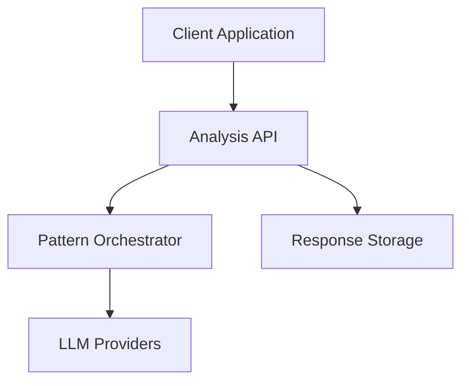
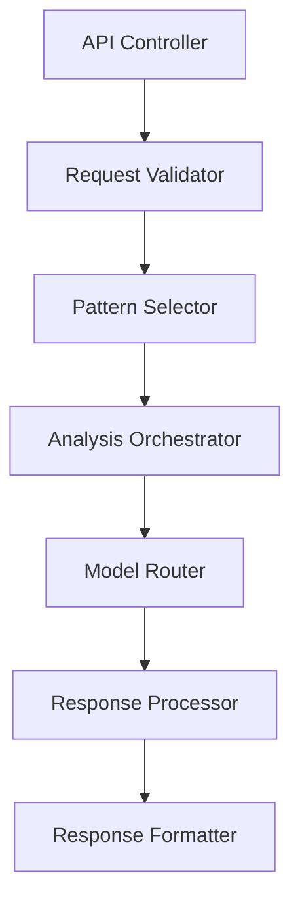

# API Specification: UltraAI Analysis Endpoints

## Overview

This document specifies the Analysis API, which is the primary interface for interacting with the UltraAI Framework's multi-model analysis capabilities. It accepts analysis requests, orchestrates multiple LLM responses according to specified patterns, and returns comprehensive analysis results.

## Architecture

### System Context



### Component Design



## Interfaces

### Public API

#### Analysis Endpoint

```
POST /api/analyze
```

**Request Body:**

```typescript
interface AnalysisRequest {
  prompt: string;                // The analysis prompt
  pattern: string;               // Analysis pattern key
  models: string[];              // Array of model identifiers
  primaryModel?: string;         // Optional primary model for synthesis
  maxTokens?: number;            // Optional token limit (default: 2048)
  temperature?: number;          // Optional temperature (default: 0.7)
  includeInitialResponses?: boolean; // Include stage responses (default: false)
}
```

**Response:**

```typescript
interface AnalysisResponse {
  result: string;                // The synthesized analysis result
  analysisId: string;            // Unique identifier for this analysis
  pattern: string;               // The pattern used for analysis
  models: string[];              // Models used in the analysis
  primaryModel: string;          // Model used for final synthesis
  initialResponses?: {           // Optional stage responses
    [modelId: string]: string;   // Model responses by model ID
  };
  metaResponses?: {              // Optional meta stage responses
    [modelId: string]: string;   // Model responses by model ID
  };
  hyperResponses?: {             // Optional hyper stage responses
    [modelId: string]: string;   // Model responses by model ID
  };
  timing: {                      // Performance timing data
    total: number;               // Total processing time in ms
    stages: {                    // Timing for each stage
      initial: number;
      meta: number;
      hyper: number;
      ultra: number;
    }
  }
}
```

#### Pattern Listing Endpoint

```
GET /api/patterns
```

**Response:**

```typescript
interface PatternsResponse {
  patterns: Array<{
    key: string;              // Internal pattern key
    name: string;             // Display name
    description: string;      // Pattern description
  }>;
}
```

#### Model Listing Endpoint

```
GET /api/models
```

**Response:**

```typescript
interface ModelsResponse {
  models: Array<{
    id: string;               // Model identifier
    name: string;             // Display name
    provider: string;         // LLM provider
    capabilities: string[];   // Model capabilities
    available: boolean;       // Availability status
  }>;
}
```

### External Dependencies

| Dependency | Purpose | Interface |
|------------|---------|-----------|
| LLM Providers | Generate model responses | Provider-specific API clients |
| Response Storage | Persist analysis results | Database interface |
| Pattern Orchestrator | Coordinate analysis workflow | Internal module interface |

## Data Models

### Core Data Structures

```typescript
interface AnalysisPattern {
  name: string;
  description: string;
  stages: string[];
  templates: {
    [stage: string]: string;
  };
  instructions: {
    [stage: string]: string[];
  };
}

interface AnalysisJob {
  id: string;
  prompt: string;
  pattern: string;
  models: string[];
  primaryModel: string;
  status: 'pending' | 'processing' | 'completed' | 'failed';
  stages: {
    [stage: string]: {
      [modelId: string]: {
        response: string;
        processingTime: number;
      }
    }
  };
  result: string;
  startTime: Date;
  endTime: Date;
  error?: string;
}
```

## Error Handling

### Error States

| Error Condition | Response | Recovery |
|-----------------|----------|----------|
| Invalid request parameters | 400 Bad Request with validation details | Client must correct request |
| Pattern not found | 404 Not Found with available patterns | Client must select valid pattern |
| Model not available | 400 Bad Request with available models | Client must select available models |
| Insufficient models | 400 Bad Request with minimum requirements | Client must provide enough models |
| LLM provider error | 502 Bad Gateway with error details | System retries with fallback if configured |
| Timeout | 504 Gateway Timeout | Client can retry with simplified request |

## Performance Considerations

### Scalability

- The API is designed to handle concurrent analysis requests
- Long-running analyses are processed asynchronously
- Rate limiting is implemented to prevent abuse
- Request queuing manages load during peak usage

### Efficiency

- Response caching for identical prompts
- Batch processing of LLM requests where possible
- Progressive response streaming for long-running analyses

## Testing Strategy

### Unit Testing

- API endpoint validation logic
- Request parameter handling
- Error response formatting

### Integration Testing

- End-to-end analysis flows with mock LLMs
- Pattern orchestration verification
- Error handling scenarios

### Performance Testing

- Response time under various loads
- Concurrent request handling
- Resource utilization monitoring

## Configuration

| Parameter | Purpose | Default | Valid Values |
|-----------|---------|---------|-------------|
| `MAX_CONCURRENT_ANALYSES` | Maximum simultaneous analyses | 10 | 1-100 |
| `DEFAULT_TIMEOUT` | Default analysis timeout in seconds | 120 | 30-300 |
| `DEFAULT_MAX_TOKENS` | Default token limit for responses | 2048 | 100-8192 |
| `ENABLE_RESPONSE_CACHING` | Enable caching identical requests | true | true/false |

## Related Documentation

- [API_DEVELOPMENT_PLAN](PLAN.md) - Parent plan for API development
- [Intelligence Multiplication Plan](../INTELLIGENCE_MULTIPLICATION_PLAN/PLAN.md) - Pattern implementation details
- [Backend Integration Plan](../BACKEND_INTEGRATION_PLAN/PLAN.md) - API infrastructure

## Changelog

| Date | Version | Changes | Author |
|------|---------|---------|--------|
| [Current Date] | 0.1 | Initial migration from legacy documentation | UltraAI Team |
