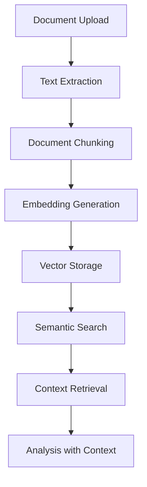

# Document Processing Overview

## Introduction

This document outlines the document processing capabilities of the UltraAI Framework. Document processing is a core component that enables analysis with document context, allowing users to upload, process, and use documents as reference material for AI-enhanced analysis.

## Core Capabilities

The UltraAI Framework implements advanced document processing capabilities:

1. **Document Upload and Validation**
   - Support for multiple file formats (PDF, DOCX, TXT, etc.)
   - File size and type validation
   - Virus scanning and security checks
   - Batch upload capabilities

2. **Text Extraction and Processing**
   - OCR for scanned documents
   - Structure preservation for formatted documents
   - Metadata extraction and indexing
   - Language detection and encoding handling

3. **Semantic Chunking**
   - Intelligent document segmentation based on content semantics
   - Variable chunk sizing based on content coherence
   - Paragraph and section boundary preservation
   - Hierarchical chunking for maintaining document structure

4. **Embedding Generation**
   - Vector embedding creation for document chunks
   - Multiple embedding model support
   - Optimized embedding storage
   - Incremental embedding updates

5. **Semantic Search and Retrieval**
   - Vector-based semantic search across documents
   - Relevance scoring and ranking
   - Hybrid retrieval combining semantic and keyword search
   - Context-aware query expansion

6. **Document Management**
   - Organization by projects and collections
   - Version control for document revisions
   - Collaborative access controls
   - Document metadata management

## System Architecture

## Performance Considerations

- **Chunking Strategies**: Balancing chunk size for retrieval effectiveness
- **Embedding Models**: Trade-offs between speed, accuracy, and dimension size
- **Caching Mechanisms**: Optimizing for repeated queries
- **Batch Processing**: Handling large document volumes efficiently
- **Worker Threads**: CPU-intensive operations executed in parallel

## Key Metrics

| Metric | Description | Target |
|--------|-------------|--------|
| Processing Time | Time from upload to searchable | <30 seconds per MB |
| Chunking Quality | Semantic coherence of chunks | >85% coherence score |
| Retrieval Precision | Relevant chunks returned | >80% precision at top 5 |
| Retrieval Recall | Relevant info captured | >75% recall for key facts |
| Storage Efficiency | Storage used per document | <1.5x original size |

## Future Enhancements

- **Multi-modal Document Processing**: Support for images, diagrams, and tables
- **Document Understanding**: Deeper structural comprehension
- **Cross-Document Relationships**: Understanding connections between documents
- **Interactive Document Exploration**: User-guided document navigation
- **Adaptive Chunking**: Context-specific chunking strategies

## Related Documentation

- [DOCUMENT_PROCESSING_PLAN](PLAN.md) - Parent plan document
- [API Specification](../API_DEVELOPMENT_PLAN/API_SPECIFICATION.md) - API endpoints for document processing
- [Data Management Plan](../DATA_MANAGEMENT_PLAN/PLAN.md) - Storage infrastructure

## Changelog

| Date | Version | Changes | Author |
|------|---------|---------|--------|
| [Current Date] | 0.1 | Initial migration from legacy documentation | UltraAI Team |
