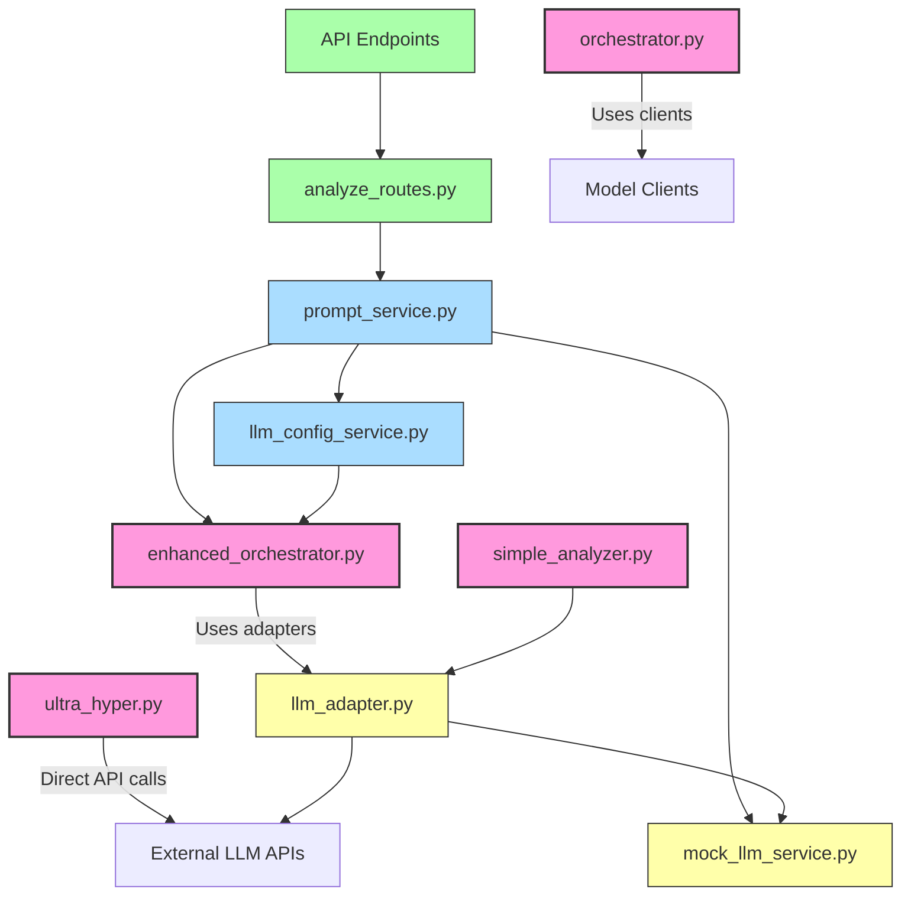

# Current System Data Flow Analysis

## Overview

Based on the code review, I've identified multiple overlapping implementations of LLM orchestration in the Ultra system. This document maps out how data flows between different components in the current system and identifies areas of confusion and redundancy.

## Current Data Flow

## Primary Orchestration Components

The system currently has **four separate orchestration implementations**:

1. **EnhancedOrchestrator** (`enhanced_orchestrator.py`)

   - The most feature-rich implementation
   - Supports analysis patterns, circuit breakers, caching, streaming
   - Used by the main API routes through `prompt_service.py`
   - Has two duplicate implementations - one in `backend/models/` and one in `src/models/`

2. **TriLLMOrchestrator** (`ultra_hyper.py`)

   - The original implementation
   - Makes direct API calls to LLM providers
   - Handles four phases: initial, meta, ultra, and hyper
   - Located in `src/core/`
   - Has a duplicate in `src/legacy/`

3. **MultiLLMOrchestrator** (`orchestrator.py`)

   - Simpler implementation with fewer features
   - Supports model registration and weighting
   - Located in `src/`
   - Not clearly connected to the rest of the system

4. **SimpleAnalyzer** (`simple_analyzer.py`)
   - Newest implementation created to simplify the system
   - Provides a command-line interface
   - Uses the LLM adapters
   - Located in root directory

## Service Components

1. **PromptService** (`prompt_service.py`)

   - Initializes and manages orchestrators
   - Processes prompts with different analysis modes
   - Handles fallback to mock implementation
   - Acts as intermediary between API routes and orchestrators

2. **LLMConfigService** (`llm_config_service.py`)
   - Manages LLM configurations and availability
   - Registers models with orchestrators
   - Provides information about available models, patterns, and modes
   - Implemented as a singleton

## Adapter Components

1. **LLM Adapters** (`llm_adapter.py`)

   - Provides standardized interface for different LLM providers
   - Includes adapters for OpenAI, Anthropic, Gemini, Mistral, Cohere
   - Handles API authentication, rate limiting, retry logic
   - Central component used by multiple orchestration systems

2. **MockLLMService** (`mock_llm_service.py`)
   - Provides mock responses for development without API keys
   - Used as fallback by multiple components
   - Two implementations (in `backend/` and in `tests/`)

## Current Pain Points and Confusion

1. **Duplicate Implementations**:

   - `EnhancedOrchestrator` exists in both `backend/models/` and `src/models/`
   - `ultra_hyper.py` exists in both `src/core/` and `src/legacy/`
   - `MockLLMService` exists in multiple locations

2. **Inconsistent Interface Patterns**:

   - Different parameter naming and structures between orchestrators
   - Inconsistent error handling approaches
   - Variable return format structures

3. **Complex Configuration Management**:

   - `LLMConfigService` acts as a registry but also directly configures orchestrators
   - Environment variable management spread across multiple files
   - Service often needs to handle missing orchestrator features

4. **Unclear Responsibility Boundaries**:

   - `PromptService` both controls orchestrators and handles fallback logic
   - `analyze_routes.py` contains business logic that should be in services
   - Some orchestrators make direct API calls while others use adapters

5. **Testing and Mocking Complexity**:

   - Multiple approaches to mock mode across the system
   - Inconsistent testing strategies
   - No clear mocking boundaries for testing

6. **Confusing File Organization**:
   - Core functionality split between `src/`, `backend/`, and root directory
   - Multiple layers of adapters and services with similar names
   - Legacy and current code mixed together

## Data Flow Issues

1. **Initialization Chain Complexity**:

   - `analyze_routes.py` → `PromptService` → `LLMConfigService` → `EnhancedOrchestrator`
   - Multiple initialization stages create hidden dependencies
   - Brittle error handling across chain

2. **Configuration Flow Problems**:

   - Models registered through chain of service calls
   - API keys pass through multiple layers
   - Environment variables accessed inconsistently

3. **Response Processing Inconsistency**:

   - Each orchestrator has different response format
   - Transformation logic spread across multiple files
   - Unclear where final response format is defined

4. **Error Handling Gaps**:
   - Multiple error handling approaches
   - Inconsistent fallback strategies
   - Retry logic implemented differently
