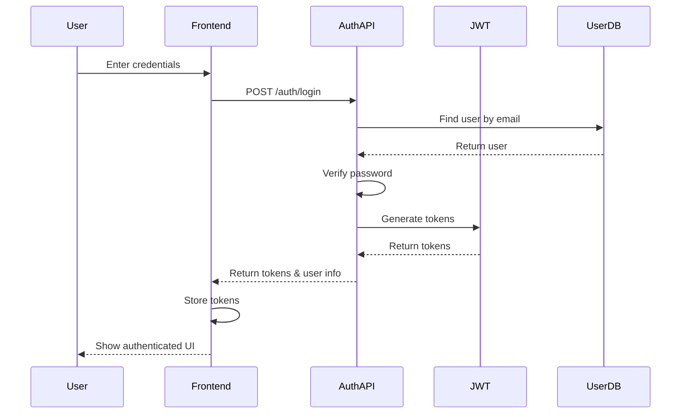

# SimpleAuthenticationSystem Action Plan (6 of 16)

## Overview

**Status:** Completed
**Created:** 2025-05-13
**Last Updated:** 2025-05-13
**Expected Completion:** 2025-05-20

## Objective

Implement a simple, secure authentication system for the Ultra MVP that enables basic user management, API key protection, and session handling while maintaining a straightforward user experience.

## Value to Program

This action directly addresses security and user management requirements for the MVP by:

1. Protecting API endpoints from unauthorized access
2. Securing sensitive LLM API keys
3. Enabling user-specific configurations and history
4. Providing basic session management
5. Laying the foundation for future role-based access control

## Success Criteria

- [x] Implement user registration and login functionality
- [x] Create secure password storage with proper hashing
- [x] Implement JWT-based authentication for API requests
- [x] Add session management for web interface
- [x] Protect API keys and sensitive configuration
- [x] Create user-specific settings and preferences
- [x] Implement basic error handling for authentication failures
- [x] Add documentation for authentication system

## Implementation Plan

### Phase 1: Core Authentication Components (Days 1-2)

1. Implement user data model:

   - User schema with email, password hash, created/updated timestamps
   - Password hashing and verification
   - User repository for storage and retrieval

2. Create authentication service:

   - User registration with validation
   - Login functionality with credential verification
   - JWT token generation and validation
   - Session management

3. Implement authentication middleware:

   - JWT validation middleware
   - Route protection
   - User context extraction from tokens

### Phase 2: API Integration (Days 3-4)

1. Create authentication API endpoints:

   - Registration endpoint
   - Login endpoint
   - Password reset
   - Token refresh
   - User profile

2. Update existing API endpoints:

   - Add authentication requirements
   - Include user context in requests
   - Implement user-specific resources

3. Implement API key security:

   - Associate API keys with users
   - Implement key rotation and revocation
   - Add key usage tracking

### Phase 3: Frontend Integration (Days 5-6)

1. Create authentication UI components:

   - Login form
   - Registration form
   - Password reset form
   - User profile management

2. Implement frontend authentication flow:

   - Token storage and management
   - Authentication state management
   - Protected route handling

3. Add user-specific features:

   - User settings page
   - Preferences management
   - History tracking

### Phase 4: Testing and Documentation (Day 7)

1. Implement authentication tests:

   - Unit tests for authentication logic
   - Integration tests for API endpoints
   - End-to-end tests for authentication flows

2. Create authentication documentation:

   - User guide for authentication
   - Developer documentation for auth system
   - Security recommendations

3. Perform security review:

   - Vulnerability assessment
   - Best practices review
   - Threat modeling

## Dependencies

- API Integration (for securing API endpoints)
- UI Prototype Integration (for authentication UI)
- Basic Security Implementation (for secure password handling)

## Risks and Mitigations

| Risk | Impact | Likelihood | Mitigation |
|------|--------|------------|------------|
| Security vulnerabilities in auth system | High | Medium | Follow best practices, use established libraries, conduct security review |
| Complex authentication impacting UX | Medium | Medium | Keep authentication simple for MVP, focus on core functionality |
| Password reset complexity | Medium | Low | Implement simplified reset flow for MVP with secure token-based approach |
| Session management issues | Medium | Low | Use standard library for session management with appropriate timeout |

## Technical Specifications

### User Schema

```typescript
interface User {
  id: string;
  email: string;
  password_hash: string;
  first_name?: string;
  last_name?: string;
  created_at: Date;
  updated_at: Date;
  last_login?: Date;
  settings: {
    default_models: string[];
    default_patterns: string[];
    theme_preference: string;
    notification_preferences: NotificationPreferences;
  };
}

interface NotificationPreferences {
  email_notifications: boolean;
  analysis_completion: boolean;
  system_updates: boolean;
}
```

### Authentication Flow



### Security Measures

1. **Password Security**:
   - Passwords stored using Argon2id hashing
   - Minimum password strength requirements
   - Rate limiting on authentication attempts

2. **JWT Security**:
   - Short-lived access tokens (15 minutes)
   - Longer-lived refresh tokens (7 days)
   - Secure token storage recommendations

3. **API Security**:
   - HTTPS-only communication
   - CSRF protection
   - Strict Content Security Policy

### API Endpoints

#### Authentication Endpoints

```
POST /api/auth/register
- Request: { email, password, first_name?, last_name? }
- Response: { user, tokens }

POST /api/auth/login
- Request: { email, password }
- Response: { user, tokens }

POST /api/auth/refresh
- Request: { refresh_token }
- Response: { tokens }

POST /api/auth/logout
- Request: { refresh_token }
- Response: { success }

POST /api/auth/forgot-password
- Request: { email }
- Response: { success }

POST /api/auth/reset-password
- Request: { token, new_password }
- Response: { success }
```

#### User Profile Endpoints

```
GET /api/users/me
- Response: { user }

PATCH /api/users/me
- Request: { first_name?, last_name?, settings? }
- Response: { user }

PUT /api/users/me/password
- Request: { current_password, new_password }
- Response: { success }
```

### Frontend Components

1. **Authentication Pages**:
   - Login Page
   - Registration Page
   - Password Reset Request Page
   - Password Reset Page

2. **User Profile Components**:
   - Profile Information Form
   - Password Change Form
   - Settings Management Form

3. **Authentication State Management**:
   - Authentication Context
   - Token Storage
   - Authorization Headers Management

## Implementation Details

### User Repository Implementation

We'll implement a user repository with the following functionality:

```python
class UserRepository:
    async def create_user(self, email: str, password: str, **kwargs) -> User:
        """Create a new user with hashed password."""
        password_hash = hash_password(password)
        user = User(email=email, password_hash=password_hash, **kwargs)
        # Store user in database
        return user
    
    async def find_user_by_email(self, email: str) -> Optional[User]:
        """Find a user by email."""
        # Query database for user with email
        return user if user_exists else None
    
    async def find_user_by_id(self, user_id: str) -> Optional[User]:
        """Find a user by ID."""
        # Query database for user with ID
        return user if user_exists else None
    
    async def update_user(self, user_id: str, **updates) -> User:
        """Update user details."""
        # Update user in database
        return updated_user
    
    async def delete_user(self, user_id: str) -> bool:
        """Delete a user."""
        # Delete user from database
        return success
```

### Authentication Service Implementation

The authentication service will handle user authentication and token management:

```python
class AuthenticationService:
    def __init__(self, user_repository: UserRepository):
        self.user_repository = user_repository
    
    async def register_user(self, email: str, password: str, **kwargs) -> Tuple[User, Tokens]:
        """Register a new user and return tokens."""
        # Validate email and password
        # Check if user already exists
        user = await self.user_repository.create_user(email, password, **kwargs)
        tokens = self._generate_tokens(user)
        return user, tokens
    
    async def authenticate_user(self, email: str, password: str) -> Tuple[User, Tokens]:
        """Authenticate a user and return tokens."""
        user = await self.user_repository.find_user_by_email(email)
        if not user:
            raise AuthenticationError("Invalid credentials")
        
        if not verify_password(password, user.password_hash):
            raise AuthenticationError("Invalid credentials")
        
        # Update last login timestamp
        user = await self.user_repository.update_user(
            user.id, last_login=datetime.utcnow()
        )
        
        tokens = self._generate_tokens(user)
        return user, tokens
    
    def _generate_tokens(self, user: User) -> Tokens:
        """Generate access and refresh tokens for a user."""
        payload = {
            "sub": user.id,
            "email": user.email,
        }
        
        access_token = create_jwt(
            payload, 
            expires_in=timedelta(minutes=15)
        )
        
        refresh_token = create_jwt(
            payload, 
            expires_in=timedelta(days=7)
        )
        
        return Tokens(access_token=access_token, refresh_token=refresh_token)
    
    async def refresh_tokens(self, refresh_token: str) -> Tokens:
        """Refresh access token using refresh token."""
        # Validate refresh token
        payload = verify_jwt(refresh_token)
        user = await self.user_repository.find_user_by_id(payload["sub"])
        if not user:
            raise AuthenticationError("Invalid refresh token")
        
        return self._generate_tokens(user)
```

### Authentication Middleware Implementation

The authentication middleware will protect API routes:

```python
class AuthenticationMiddleware:
    async def __call__(self, request: Request, call_next):
        # Skip authentication for public routes
        if is_public_route(request.url.path):
            return await call_next(request)
        
        # Get authorization header
        authorization = request.headers.get("Authorization")
        if not authorization or not authorization.startswith("Bearer "):
            return JSONResponse(
                status_code=401,
                content={"detail": "Not authenticated"}
            )
        
        token = authorization.replace("Bearer ", "")
        
        try:
            # Verify token
            payload = verify_jwt(token)
            
            # Add user to request state
            request.state.user_id = payload["sub"]
            request.state.email = payload["email"]
            
            # Continue to next middleware/handler
            return await call_next(request)
        except JWTError:
            return JSONResponse(
                status_code=401,
                content={"detail": "Invalid authentication token"}
            )
```

## Documentation Plan

The following documentation will be created:

1. **User Documentation**:
   - Registration and login guide
   - Password management
   - User profile management
   - Settings configuration

2. **Developer Documentation**:
   - Authentication system architecture
   - Security implementation details
   - API authentication guide
   - Token handling best practices

3. **Security Documentation**:
   - Authentication security measures
   - Token management security
   - Password security
   - API key protection