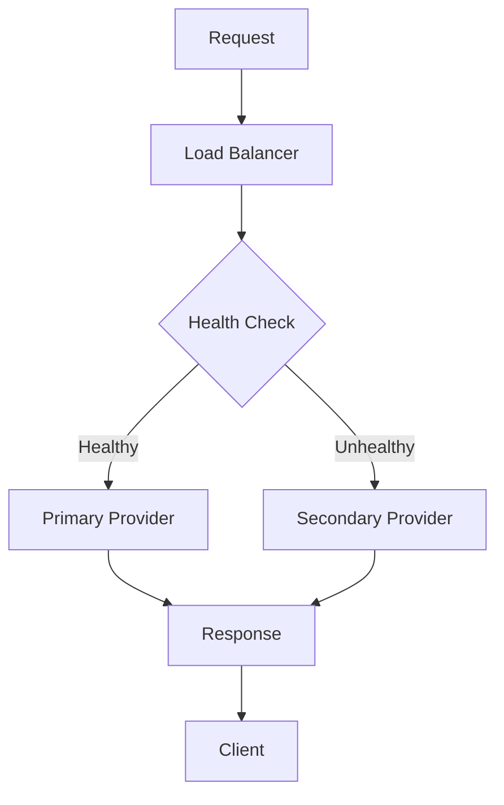

# LLM Provider Failover Design

## Overview

This document outlines the design for automatic LLM provider failover to ensure continuous service availability.

## Architecture



## Provider Configuration

### Primary Providers

1. OpenAI (GPT-4)
2. Anthropic (Claude-3)

### Secondary Providers

1. Google (Gemini)
2. Cohere (Command)

### Tertiary Providers

1. Local models (Llama)
2. Cached responses

## Health Check System

### Check Frequency

- Normal: Every 30 seconds
- Degraded: Every 10 seconds
- Failed: Every 5 seconds

### Health Criteria

1. Response time < 5 seconds
2. Success rate > 95%
3. Valid response format
4. Token availability

### Health States

- **Healthy**: All criteria met
- **Degraded**: Performance issues
- **Failed**: Provider unavailable

## Failover Strategy

### Detection

1. Monitor request failures
2. Track response times
3. Check error patterns
4. Validate responses

### Switching Logic

1. Primary provider fails
2. Check secondary availability
3. Route traffic to secondary
4. Monitor primary recovery

### Load Distribution

- Round-robin for healthy providers
- Weighted based on performance
- Sticky sessions for consistency
- Geographic routing when applicable

## Session Management

### Sticky Sessions

- User preference persistence
- Context preservation
- Result consistency
- Performance optimization

### Session Migration

1. Detect provider failure
2. Save session state
3. Transfer to new provider
4. Restore conversation context

## Recovery Procedures

### Automatic Recovery

1. Continue health checks
2. Detect provider recovery
3. Gradual traffic restoration
4. Performance validation

### Manual Intervention

1. Alert operations team
2. Review failure logs
3. Manual provider selection
4. Force recovery if needed

## Performance Optimization

### Request Routing

- Parallel health checks
- Async provider selection
- Request queuing
- Priority handling

### Response Caching

- Common query results
- Provider-agnostic cache
- TTL management
- Cache warming

## Monitoring

### Metrics

- Provider availability
- Failover frequency
- Response times
- Success rates

### Alerts

- Provider failures
- Frequent failovers
- Performance degradation
- Capacity issues

## Configuration

```yaml
failover:
  enabled: true
  providers:
    primary:
      - name: openai
        weight: 50
        timeout: 5000
      - name: anthropic
        weight: 50
        timeout: 5000
    secondary:
      - name: google
        weight: 60
        timeout: 7000
      - name: cohere
        weight: 40
        timeout: 7000
  health_check:
    interval: 30
    timeout: 5
    retries: 3
  circuit_breaker:
    threshold: 5
    timeout: 60
    half_open_requests: 3
```

## Testing

### Failure Scenarios

1. Complete provider outage
2. Partial availability
3. Performance degradation
4. Invalid responses

### Load Testing

1. Normal traffic patterns
2. Spike conditions
3. Sustained high load
4. Provider switching

### Validation

1. Data consistency
2. Response accuracy
3. Performance metrics
4. User experience
