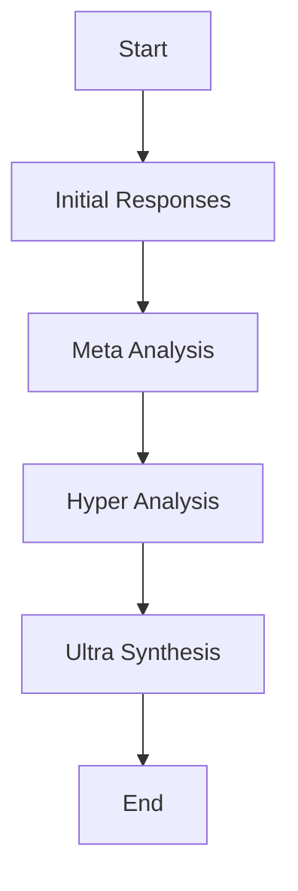

# Analysis Workflow

## Overview

This document describes the orchestrated multi-stage analysis workflow implemented in the UltraAI Frontend. This workflow guides users through the process of combining responses from multiple Large Language Models (LLMs) into a comprehensive analysis.

## Workflow Diagram

## Frontend Implementation

The UltraAI Framework frontend implements a step-by-step guided workflow for users to:

1. Enter their analysis prompt
2. Select the models to use
3. Choose the analysis pattern
4. View the results of the multi-stage analysis

## Steps

### 1. Initial Responses

**Description**: In this first stage, the system gathers independent responses from all selected models based on the user's initial prompt.

**Frontend Elements**:

- Prompt input form with guidelines
- Model selection interface with capabilities displayed
- Progress indicator showing model processing
- Preview panel for initial responses (optional)

### 2. Meta Analysis

**Description**: Each model analyzes and reviews the collective responses from the initial stage, providing higher-level insights.

**Frontend Elements**:

- Progress indicator showing meta analysis stage
- Stage description explaining the meta analysis process
- Visualization of cross-model analysis (optional)

### 3. Hyper Analysis

**Description**: Models analyze the meta-level reviews, looking for patterns, agreements, disagreements, and insights across the reviews.

**Frontend Elements**:

- Progress indicator showing hyper analysis stage
- Stage description explaining the hyper analysis process
- Visualization of emerging insights (optional)

### 4. Ultra Synthesis

**Description**: A final comprehensive synthesis is produced, bringing together all levels of analysis into a coherent, integrated response.

**Frontend Elements**:

- Results display with formatted synthesis
- Options to explore individual model contributions
- Export/save/share functionality
- Option to start new analysis

## User Interface Components

### Analysis Form

- **Prompt Input**: Large text area with character count and guidelines
- **Model Selection**: Checkboxes/toggles for available models with model details
- **Primary Model**: Dropdown to select the primary synthesis model
- **Pattern Selection**: Cards/dropdown for analysis pattern options with descriptions
- **Advanced Options**: Expandable section for token limits, temperature, etc.

### Progress Display

- **Stage Indicator**: Visual display of current analysis stage
- **Progress Bar**: Overall completion percentage
- **Time Estimate**: Approximate time remaining
- **Cancel Option**: Button to cancel analysis in progress

### Results View

- **Main Result**: Formatted display of the final synthesis
- **Contributing Insights**: Expandable sections showing model contributions
- **Process Breakdown**: Option to view the multi-stage analysis process
- **Actions**: Buttons for copying, exporting, or sharing the results

## Error Handling

### User Interface Errors

- **Input Validation**: Immediate feedback for invalid inputs
- **Model Selection Requirements**: Guidance when insufficient models selected
- **Connection Issues**: Clear error messages for API connectivity problems
- **Analysis Failures**: Graceful error recovery with retry options

## Performance Considerations

- **Progressive Loading**: Display results as they become available
- **Background Processing**: Allow users to navigate away during processing
- **Caching Responses**: Store recent analyses for quick retrieval
- **Responsive Design**: Optimize for different screen sizes and devices

## Related Documentation

- [FRONTEND_DEVELOPMENT_PLAN](PLAN.md) - Parent plan document
- [Intelligence Multiplication Patterns](../INTELLIGENCE_MULTIPLICATION_PLAN/PATTERNS.md) - Pattern implementation details
- [API Specification](../API_DEVELOPMENT_PLAN/API_SPECIFICATION.md) - Backend API endpoints

## Changelog

| Date | Version | Changes | Author |
|------|---------|---------|--------|
| [Current Date] | 0.1 | Initial migration from legacy documentation | UltraAI Team |
