# Enhanced Orchestrator Data Flow Diagram

```mermaid
graph TD
    %% Client/Entry Points
    Client[Client Code or Script] --> RunEnhancedTest
    RunEnhancedTest["run_enhanced_test.py\n- Initiates enhanced orchestration flow"]
    EnhancedInteractive["examples/enhanced_interactive.py\n- Interactive testing script"]
    RunSpecificTest["run_specific_prompt.py\n- Test with specific prompt"]

    %% Factory Methods
    RunEnhancedTest --> Factory
    EnhancedInteractive --> Factory
    RunSpecificTest --> Factory
    Factory["factory.py\n- create_from_env(enhanced=True)\n- create_orchestrator(config, enhanced=True)"]

    %% Component Creation
    Factory --> |"Creates"| EOrch
    Factory --> |"Creates"| Prompts
    Factory --> |"Creates"| Quality
    Factory --> |"Creates"| Cache

    %% Core Components
    EOrch["enhanced_orchestrator.py\n- EnhancedOrchestrator class\n- Multi-stage processing"]
    Prompts["prompt_templates.py\n- PromptTemplates class\n- Templates for each stage"]
    Quality["quality_metrics.py\n- QualityMetrics class\n- Response evaluation"]
    Cache["cache_service.py\n- CacheService class\n- Caching responses"]
    Config["config.py\n- Config & ModelDefinition classes\n- Orchestration settings"]

    %% Adapter Components
    Factory --> |"Creates for each model"| AdapterInterface
    AdapterInterface["adapter.py\n- Adapter interface\n- Provider implementations"]
    OpenAIAdapter["adapter.py:OpenAIAdapter\n- OpenAI API integration"]
    AnthropicAdapter["adapter.py:AnthropicAdapter\n- Anthropic API integration"]
    GeminiAdapter["adapter.py:GeminiAdapter\n- Google Gemini integration"]
    LlamaAdapter["adapter.py:LlamaAdapter\n- Local Llama integration"]

    AdapterInterface --> OpenAIAdapter
    AdapterInterface --> AnthropicAdapter
    AdapterInterface --> GeminiAdapter
    AdapterInterface --> LlamaAdapter

    %% Main Orchestration Flow
    Client --> |"Request"| EOrch
    EOrch --> |"1. Check cache"| Cache
    Cache --> |"Cache hit/miss"| EOrch

    %% Stage 1: Initial Responses
    EOrch --> |"2. Format initial prompt"| Prompts
    Prompts --> |"format_initial_prompt()"| EOrch
    EOrch --> |"3. _get_initial_responses()"| EOrch
    EOrch --> |"Send prompt to models"| AdapterInterface
    AdapterInterface --> |"generate() responses"| EOrch
    EOrch --> |"Evaluate responses"| Quality
    Quality --> |"evaluate() scores"| EOrch

    %% Stage 2: Meta-Analysis
    EOrch --> |"4. Format meta-analysis prompt"| Prompts
    Prompts --> |"format_meta_analysis_prompt()"| EOrch
    EOrch --> |"5. _perform_meta_analysis()"| EOrch
    EOrch --> |"Send meta prompt to models"| AdapterInterface
    AdapterInterface --> |"generate() analyses"| EOrch

    %% Stage 3: Synthesis
    EOrch --> |"6. Format synthesis prompt"| Prompts
    Prompts --> |"format_synthesis_prompt()"| EOrch
    EOrch --> |"7. _synthesize_results()"| EOrch
    EOrch --> |"Send synthesis prompt"| AdapterInterface
    AdapterInterface --> |"generate() synthesis"| EOrch

    %% Response Selection
    EOrch --> |"8. _select_best_response()"| EOrch
    Quality --> |"Influence selection"| EOrch

    %% Result Formatting & Cache
    EOrch --> |"9. Format result with all stages"| EOrch
    EOrch --> |"10. Cache result"| Cache
    EOrch --> |"11. Return result"| Client

    %% Configuration Influence
    Config --> |"Affects processing"| EOrch
    Config --> |"to_cache_key()"| Cache

    %% Method Detail Expansions
    subgraph "EnhancedOrchestrator.process()"
        Process["Main orchestration method\n- Coordinates all stages\n- Handles errors"]
        GetInitial["_get_initial_responses()\n- Gets responses from all models\n- Evaluates quality"]
        PerformMeta["_perform_meta_analysis()\n- Generates meta-analyses\n- Compares responses"]
        Synthesize["_synthesize_results()\n- Creates optimized response\n- Combines best elements"]
        ProcessModel["_process_with_model()\n- Handles individual model requests\n- Times responses"]
        SelectBest["_select_best_response()\n- Selects highest quality response\n- Falls back to priority"]
    end

    subgraph "QualityMetrics.evaluate()"
        Evaluate["evaluate()\n- Evaluates response quality"]
        Heuristic["_heuristic_evaluation()\n- Length (20%)\n- Coherence (30%)\n- Specificity (40%)\n- Confidence (10%)"]
        ModelBased["_model_based_evaluation()\n- Future enhancement"]
    end

    subgraph "PromptTemplates"
        InitialTemplate["format_initial_prompt()\n- Simple format with system prompt"]
        MetaTemplate["format_meta_analysis_prompt()\n- Template for comparing responses"]
        SynthesisTemplate["format_synthesis_prompt()\n- Template for creating optimal response"]
    end

    %% Data Outputs at Each Stage
    ProcessOut1["STAGE 1 OUTPUT:\nInitial Responses\n- Model name/provider\n- Response text\n- Response time\n- Quality score"]
    ProcessOut2["STAGE 2 OUTPUT:\nMeta-Analyses\n- Strengths/weaknesses\n- Most helpful response\n- Missing information\n- Factual consistency"]
    ProcessOut3["STAGE 3 OUTPUT:\nSynthesized Response\n- Combined optimal answer\n- Based on analyses"]
    ProcessOut4["FINAL OUTPUT:\nComplete Result\n- All initial responses\n- All meta-analyses\n- Synthesized response\n- Best individual response"]

    GetInitial --> ProcessOut1
    PerformMeta --> ProcessOut2
    Synthesize --> ProcessOut3
    Process --> ProcessOut4

    %% External Dependencies
    OpenAI["OpenAI API"]
    Anthropic["Anthropic API"]
    Google["Google API"]
    Llama["Local Llama model"]

    OpenAIAdapter --> OpenAI
    AnthropicAdapter --> Anthropic
    GeminiAdapter --> Google
    LlamaAdapter --> Llama

    %% Environment Influence
    Environment["Environment Variables\n- API keys\n- Model configurations"]
    Environment --> Factory
```



## Component Descriptions

### Entry Points

- **run_enhanced_test.py**: Test script that runs the enhanced orchestrator with a specific prompt
- **examples/enhanced_interactive.py**: Interactive script for testing with user-provided prompts
- **run_specific_prompt.py**: Script for running a specific prompt through the orchestrator

### Core Components

- **factory.py**: Creates and configures orchestrator and adapters
- **enhanced_orchestrator.py**: Implements multi-stage orchestration process
- **prompt_templates.py**: Provides templates for different stages of processing
- **quality_metrics.py**: Evaluates and ranks responses
- **cache_service.py**: Caches responses to improve performance
- **config.py**: Defines configuration structure for orchestration
- **adapter.py**: Defines adapter interface and provider implementations

### Data Flow Stages

#### Stage 1: Initial Responses

- Client sends request with prompt
- Orchestrator checks cache for existing response
- If not cached, format initial prompt
- Send prompt to all configured models in parallel
- Collect responses and evaluate quality

#### Stage 2: Meta-Analysis

- Format meta-analysis prompt with initial responses
- Send to selected meta models
- Collect meta-analyses of responses

#### Stage 3: Synthesis

- Format synthesis prompt with responses and analyses
- Send to synthesis model
- Generate optimized response

#### Final Processing

- Select best individual response based on quality
- Format comprehensive result with all stages
- Cache result for future use
- Return complete result to client

### Output Formats

#### Initial Responses Output

```json
{
  "model": "openai-gpt4o",
  "provider": "openai",
  "response": "Response text from model...",
  "response_time": 8.06,
  "quality_score": 1.0
}
```

#### Meta-Analysis Output

```json
{
  "model": "openai-gpt4o",
  "provider": "openai",
  "analysis": "Analysis of all responses...",
  "response_time": 5.23
}
```

#### Synthesis Output

```jsonso wha
{
  "response": "Synthesized optimal response...",
  "model": "openai-gpt4o",
  "provider": "openai",
  "time": 6.43
}
```

#### Final Result Output

```json
{
  "prompt": "Original prompt text...",
  "initial_responses": [...],
  "meta_analyses": [...],
  "synthesis": {...},
  "selected_response": {...}
}
```

## Key Methods Affecting Output

### PromptTemplates

- **format_initial_prompt()**: Determines how the initial prompt is formatted
- **format_meta_analysis_prompt()**: Creates the prompt for analyzing responses
- **format_synthesis_prompt()**: Creates the prompt for synthesizing an optimal answer

### QualityMetrics

- **evaluate()**: Evaluates response quality using heuristics
- **\_heuristic_evaluation()**: Applies weights to different quality factors:
  - Length (20%)
  - Coherence (30%)
  - Specificity (40%)
  - Confidence (10%)

### EnhancedOrchestrator

- **process()**: Main orchestration method
- **\_get_initial_responses()**: Gets and evaluates initial responses
- **\_perform_meta_analysis()**: Generates analyses of responses
- **\_synthesize_results()**: Creates optimized response
- **\_select_best_response()**: Selects highest quality individual response
