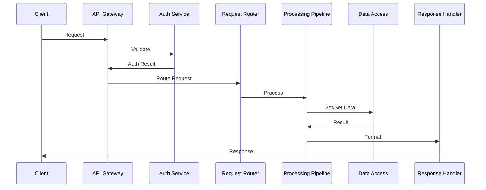
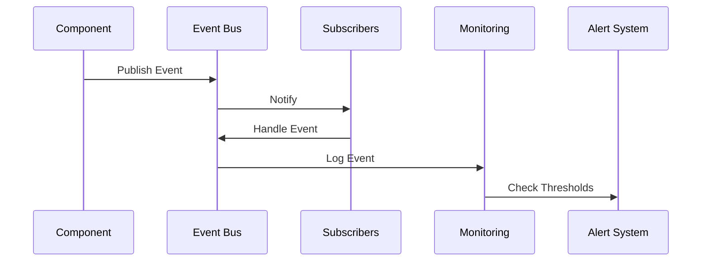
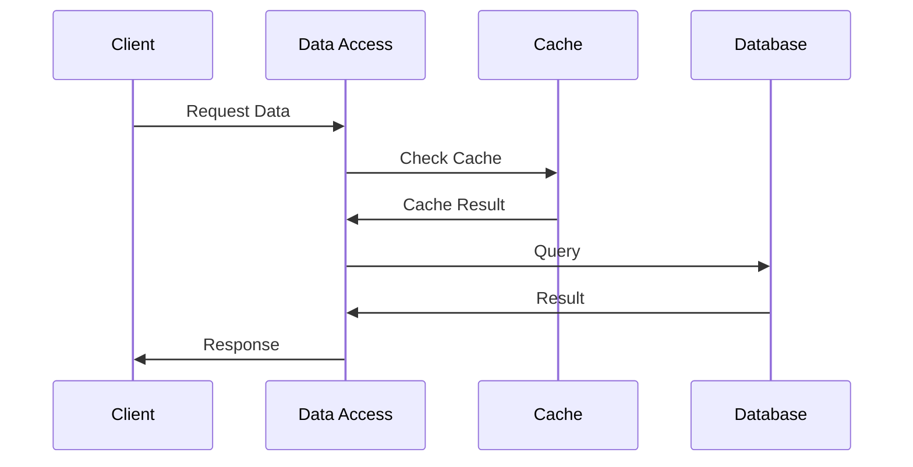
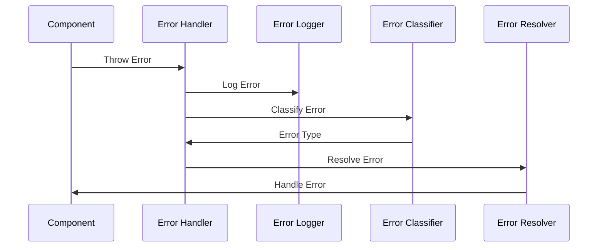

# UltraAI System Architecture

## Overview

This document defines the core system architecture for the UltraAI system, including component definitions, boundaries, responsibilities, and interactions.

## Core System Modules

### 1. Core Module

- **Purpose**: Central system functionality and coordination
- **Components**:
  - System Orchestrator
  - Configuration Manager
  - Event Bus
  - State Manager
- **Responsibilities**:
  - System initialization and shutdown
  - Component coordination
  - State management
  - Event handling
- **Interfaces**:
  - Configuration API
  - Event API
  - State API

### 2. API Module

- **Purpose**: External and internal API management
- **Components**:
  - API Gateway
  - Request Router
  - Response Handler
  - Rate Limiter
- **Responsibilities**:
  - Request handling
  - Response formatting
  - API versioning
  - Rate limiting
- **Interfaces**:
  - REST API
  - GraphQL API
  - WebSocket API

### 3. Data Module

- **Purpose**: Data management and persistence
- **Components**:
  - Data Access Layer
  - Cache Manager
  - Data Validator
  - Migration Manager
- **Responsibilities**:
  - Data storage and retrieval
  - Caching
  - Data validation
  - Schema management
- **Interfaces**:
  - Data Access API
  - Cache API
  - Validation API

### 4. Security Module

- **Purpose**: System security and access control
- **Components**:
  - Authentication Service
  - Authorization Service
  - Encryption Service
  - Audit Logger
- **Responsibilities**:
  - User authentication
  - Access control
  - Data encryption
  - Security auditing
- **Interfaces**:
  - Auth API
  - Access Control API
  - Encryption API

### 5. Processing Module

- **Purpose**: Data processing and transformation
- **Components**:
  - Processing Pipeline
  - Task Scheduler
  - Resource Manager
  - Result Handler
- **Responsibilities**:
  - Data processing
  - Task scheduling
  - Resource allocation
  - Result management
- **Interfaces**:
  - Processing API
  - Task API
  - Resource API

### 6. Monitoring Module

- **Purpose**: System monitoring and logging
- **Components**:
  - Metrics Collector
  - Log Manager
  - Alert System
  - Health Checker
- **Responsibilities**:
  - Performance monitoring
  - Log management
  - Alert generation
  - Health monitoring
- **Interfaces**:
  - Metrics API
  - Log API
  - Alert API

## Component Interactions

### 1. Request Flow



### 2. Event Flow



### 3. Data Flow



## Component Boundaries

### 1. Module Boundaries

- Each module is self-contained with well-defined interfaces
- Modules communicate through defined APIs
- No direct dependencies between modules
- Shared functionality through core module

### 2. Data Boundaries

- Each module owns its data schema
- Data access through Data Access Layer
- No direct database access
- Caching at module level

### 3. Security Boundaries

- Authentication at API Gateway
- Authorization at module level
- Encryption at data level
- Audit logging throughout

## Interface Specifications

### 1. Core Module Interfaces

```typescript
interface ConfigurationAPI {
  getConfig(key: string): Promise<any>;
  setConfig(key: string, value: any): Promise<void>;
  validateConfig(config: any): Promise<boolean>;
}

interface EventAPI {
  publish(event: Event): Promise<void>;
  subscribe(event: string, handler: Function): Promise<void>;
  unsubscribe(event: string, handler: Function): Promise<void>;
}

interface StateAPI {
  getState(key: string): Promise<any>;
  setState(key: string, value: any): Promise<void>;
  observe(key: string, callback: Function): Promise<void>;
}
```

### 2. API Module Interfaces

```typescript
interface APIGateway {
  handleRequest(request: Request): Promise<Response>;
  validateRequest(request: Request): Promise<boolean>;
  rateLimit(request: Request): Promise<boolean>;
}

interface RequestRouter {
  route(request: Request): Promise<Handler>;
  validateRoute(route: Route): Promise<boolean>;
}
```

### 3. Data Module Interfaces

```typescript
interface DataAccess {
  query(query: Query): Promise<Result>;
  update(data: Data): Promise<void>;
  delete(id: string): Promise<void>;
}

interface CacheManager {
  get(key: string): Promise<any>;
  set(key: string, value: any): Promise<void>;
  invalidate(key: string): Promise<void>;
}
```

## Error Handling Strategy

### 1. Error Types

- System Errors
- Business Logic Errors
- Validation Errors
- External Service Errors

### 2. Error Handling Flow



### 3. Error Recovery

- Automatic retry for transient errors
- Fallback mechanisms for critical services
- Circuit breakers for external services
- Graceful degradation

## Success Criteria

The system architecture will be considered successful when:

1. All core modules are defined and documented
2. Component interactions are clearly specified
3. Interface contracts are established
4. Error handling strategy is comprehensive
5. All documentation is complete and up-to-date

## Next Steps

1. Review and approve system architecture
2. Begin implementation of core modules
3. Set up development environment
4. Create initial test suite
5. Establish CI/CD pipeline
