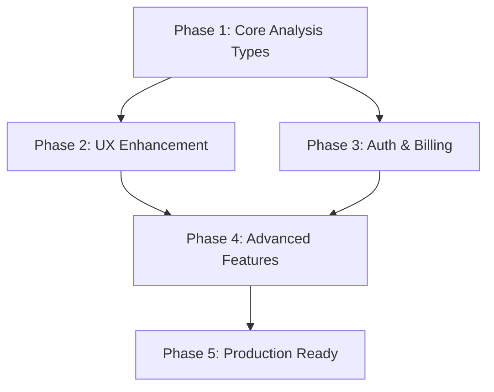

# UltrAI System Transformation Plan

## Overview
This plan outlines the transformation of the current UltrAI prototype into the full system described in the product documentation.

## Phase 1: Core Analysis Types (2-3 weeks)

### 1.1 Extend Orchestration Service
**Goal**: Support multiple analysis types beyond synthesis

**Tasks**:
- [ ] Create analysis type enum in `app/models/analysis_types.py`
  ```python
  class AnalysisType(Enum):
      SYNTHESIS = "synthesis"  # Current implementation
      CREATIVE_GENERATION = "creative_generation"  # For image/video
      DOCUMENT_ANALYSIS = "document_analysis"
      DEEP_RESEARCH = "deep_research"
      INTELLIGENCE_MULTIPLIER = "intelligence_multiplier"
      FACT_CHECK_CONFIDENCE = "fact_check_confidence"
  ```

- [ ] Extend `orchestration_service.py` to handle different analysis flows
- [ ] Create specialized prompt templates for each analysis type
- [ ] Implement analysis-specific model selection logic

### 1.2 Document Processing Pipeline
**Goal**: Enable document upload and analysis

**Tasks**:
- [ ] Add file upload endpoints in `app/routes/documents.py`
- [ ] Implement document parsers (PDF, DOCX, TXT)
- [ ] Create document chunking service for large files
- [ ] Add document-specific prompts to synthesis system

### 1.3 Research & Fact-Checking Services
**Goal**: Implement deep research and fact-checking capabilities

**Tasks**:
- [ ] Create `app/services/research_service.py`
- [ ] Implement web search integration (if not exists)
- [ ] Add fact-checking prompt strategies
- [ ] Create confidence scoring system

## Phase 2: User Experience Enhancement (2-3 weeks)

### 2.1 Complete Wizard Implementation
**Goal**: Match the 5-step wizard from the PDFs

**Current State**:
```
Step 1: Select Goal
Step 2: Enter Query  
Step 3: Select Model
Step 4: Choose Add-ons
Step 5: Review & Submit
```

**Tasks**:
- [ ] Update `frontend/src/components/wizard/CyberWizard.tsx`
- [ ] Implement proper cost calculation per step
- [ ] Add real-time cost updates in UI
- [ ] Create proper step validation

### 2.2 Advanced UI Features
**Goal**: Implement the full UI experience

**Tasks**:
- [ ] Complete skin system (night, morning, afternoon, sunset)
- [ ] Add minimalist and business themes
- [ ] Implement dynamic backgrounds as shown in PDFs
- [ ] Add glassmorphism effects to wizard panels
- [ ] Create receipt-style results display

### 2.3 Output Formatting
**Goal**: Support multiple output formats

**Tasks**:
- [ ] Implement PDF generation service
- [ ] Add encryption capabilities for outputs
- [ ] Create formatted report templates
- [ ] Add download/export functionality

## Phase 3: Authentication & Billing (1-2 weeks)

### 3.1 User Authentication System
**Goal**: Complete user account management

**Tasks**:
- [ ] Finish JWT authentication implementation
- [ ] Add user registration flow
- [ ] Implement password reset
- [ ] Add OAuth providers (Google, GitHub)

### 3.2 Billing & Credits System
**Goal**: Implement the credit-based billing system

**Tasks**:
- [ ] Create `app/models/billing.py` with credit schemas
- [ ] Implement credit deduction per analysis
- [ ] Add Stripe integration for purchases
- [ ] Create billing dashboard in frontend

### 3.3 Usage Tracking
**Goal**: Track and display user usage

**Tasks**:
- [ ] Create usage tracking service
- [ ] Add database models for usage history
- [ ] Implement usage analytics dashboard
- [ ] Add credit balance display in UI

## Phase 4: Advanced Features (2-3 weeks)

### 4.1 Intelligence Multiplier
**Goal**: Implement advanced multi-stage analysis

**Tasks**:
- [ ] Create enhanced peer review system
- [ ] Implement iterative refinement loops
- [ ] Add quality scoring between iterations
- [ ] Create specialized UI for showing iterations

### 4.2 Model Selection Intelligence
**Goal**: Smart model selection based on query type

**Tasks**:
- [ ] Enhance `app/services/model_selection.py`
- [ ] Add query classification service
- [ ] Implement model performance tracking
- [ ] Create model recommendation engine

### 4.3 Real-time Collaboration
**Goal**: Enable real-time updates during analysis

**Tasks**:
- [ ] Enhance SSE implementation
- [ ] Add WebSocket support for bidirectional communication
- [ ] Create live progress indicators
- [ ] Implement analysis pause/resume

## Phase 5: Production Readiness (1-2 weeks)

### 5.1 Performance Optimization
**Tasks**:
- [ ] Implement response caching strategies
- [ ] Add CDN for static assets
- [ ] Optimize database queries
- [ ] Implement request queuing for high load

### 5.2 Security Hardening
**Tasks**:
- [ ] Complete CSRF protection
- [ ] Add rate limiting per user/tier
- [ ] Implement API key rotation
- [ ] Add audit logging

### 5.3 Monitoring & Analytics
**Tasks**:
- [ ] Set up comprehensive logging
- [ ] Add performance monitoring (APM)
- [ ] Create admin dashboard
- [ ] Implement error tracking (Sentry)

## Implementation Order & Dependencies



## Technical Decisions Required

1. **Document Processing**: 
   - Use `pypdf`, `python-docx` for parsing
   - Consider Unstructured.io for complex documents

2. **PDF Generation**:
   - ReportLab for Python
   - Or headless Chrome for HTML-to-PDF

3. **Encryption**:
   - Use `cryptography` library
   - Implement client-side encryption option

4. **Billing**:
   - Stripe for payments
   - PostgreSQL for transaction history

5. **Real-time Updates**:
   - Enhance current SSE
   - Consider Socket.io for complex interactions

## Database Schema Updates

```sql
-- New tables needed
CREATE TABLE analysis_types (
    id UUID PRIMARY KEY,
    name VARCHAR(50) NOT NULL,
    base_cost DECIMAL(10,2),
    description TEXT
);

CREATE TABLE user_credits (
    user_id UUID REFERENCES users(id),
    balance DECIMAL(10,2) DEFAULT 0,
    updated_at TIMESTAMP DEFAULT NOW()
);

CREATE TABLE analysis_history (
    id UUID PRIMARY KEY,
    user_id UUID REFERENCES users(id),
    analysis_type VARCHAR(50),
    input_tokens INT,
    output_tokens INT,
    cost DECIMAL(10,2),
    created_at TIMESTAMP DEFAULT NOW()
);

CREATE TABLE documents (
    id UUID PRIMARY KEY,
    user_id UUID REFERENCES users(id),
    filename VARCHAR(255),
    file_type VARCHAR(50),
    file_size BIGINT,
    storage_url TEXT,
    created_at TIMESTAMP DEFAULT NOW()
);
```

## API Endpoint Additions

```yaml
# New endpoints needed
POST   /api/documents/upload
GET    /api/documents/{id}
DELETE /api/documents/{id}

POST   /api/analysis/creative
POST   /api/analysis/research  
POST   /api/analysis/fact-check

GET    /api/billing/credits
POST   /api/billing/purchase
GET    /api/billing/history

GET    /api/analysis/history
GET    /api/analysis/{id}/download

POST   /api/auth/register
POST   /api/auth/reset-password
POST   /api/auth/oauth/{provider}
```

## Frontend Component Structure

```
src/
├── components/
│   ├── wizard/
│   │   ├── steps/
│   │   │   ├── GoalSelection.tsx      # Create Image/Video, Document Analysis, etc.
│   │   │   ├── QueryInput.tsx         # Text input or file upload
│   │   │   ├── ModelSelection.tsx     # Fast, Accurate, Auto options
│   │   │   ├── AnalysisMode.tsx       # Intelligence Multiplier, Fact-Check
│   │   │   └── AddOns.tsx            # PDF Output, Encryption
│   │   └── WizardController.tsx       # Main wizard logic
│   ├── billing/
│   │   ├── CreditDisplay.tsx
│   │   ├── PurchaseModal.tsx
│   │   └── UsageHistory.tsx
│   └── results/
│       ├── SynthesisView.tsx
│       ├── CreativeView.tsx
│       ├── ResearchView.tsx
│       └── DownloadOptions.tsx
```

## Success Metrics

1. **Functionality**: All 5 analysis types working
2. **Performance**: < 30s for standard analysis
3. **UX**: Wizard completion rate > 80%
4. **Billing**: Successful payment integration
5. **Reliability**: 99.9% uptime

## Risk Mitigation

1. **Complexity**: Start with synthesis + one other type
2. **Cost**: Implement strict rate limits early
3. **Security**: Regular security audits
4. **Performance**: Load test each phase

## Next Steps

1. Review and approve this plan
2. Create AICheck actions for each phase
3. Set up development branches
4. Begin Phase 1 implementation

---

This transformation will take approximately 8-12 weeks with a small team, or 4-6 weeks with parallel development on different phases.