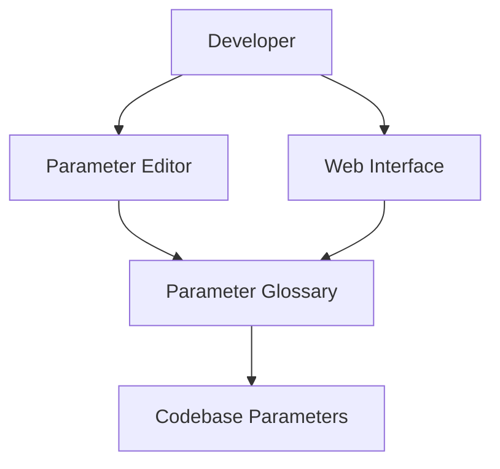
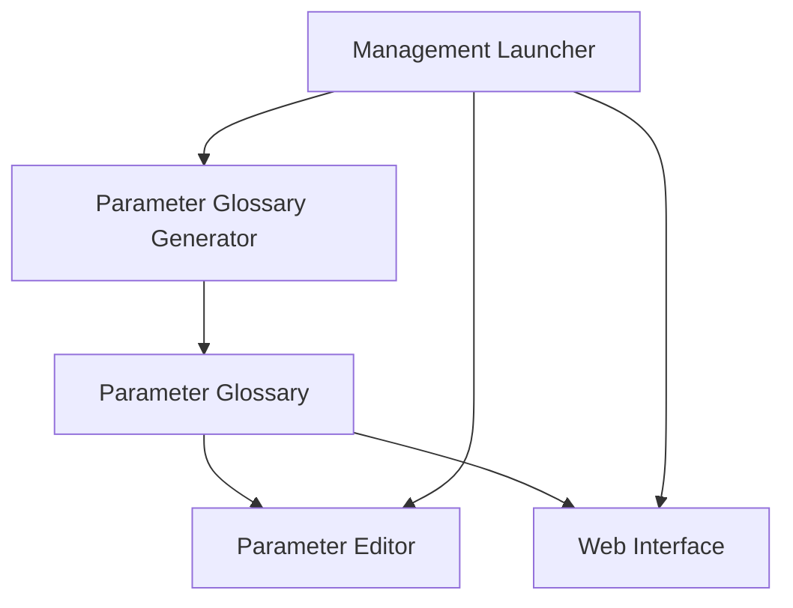

# Technical Specification: Parameter Management System

## Overview

The Parameter Management System provides a comprehensive solution for managing configurable parameters throughout the UltraAI Framework. It scans the code to identify and document parameters, then provides both a web interface and a command-line tool for viewing and modifying them.

## Architecture

### System Context



### Component Design



## Interfaces

### Command-Line Interface

```bash
# Launch the parameter management system
python backend/manage_parameters.py

# Generate a parameter glossary and exit
python backend/manage_parameters.py --generate

# Launch the parameter editor directly
python backend/manage_parameters.py --edit

# Search for specific parameters
python backend/manage_parameters.py --search "threshold"
```

### Web Interface

```
backend/parameter_glossary/parameters.html
```

### External Dependencies

| Dependency | Purpose | Interface |
|------------|---------|-----------|
| File System | Read/write parameter files | File I/O operations |
| Browser | Display web interface | HTML/CSS/JavaScript |
| Terminal | Command-line interface | Standard input/output |

## Data Models

### Parameter Record

```typescript
interface ParameterRecord {
  name: string;               // Parameter name
  value: any;                 // Current parameter value
  type: string;               // Data type (string, number, boolean, etc.)
  file: string;               // Source file location
  line: number;               // Line number in source file
  description: string;        // Extracted documentation
  category: string;           // Parameter category
  editable: boolean;          // Whether it can be modified
}
```

### Parameter Glossary

```typescript
interface ParameterGlossary {
  timestamp: string;          // Generation timestamp
  parameters: ParameterRecord[];  // Array of parameters
  categories: string[];       // Available categories
  files: string[];            // Files containing parameters
}
```

## Features

- **Automatic Parameter Discovery**: Identifies configurable parameters across the codebase
- **Documentation Extraction**: Captures inline comments and docstrings for each parameter
- **Parameter Categorization**: Organizes parameters by file and type
- **Web Interface**: Simple HTML UI for browsing and editing parameters
- **Command-Line Interface**: Terminal-based tool for quick parameter adjustments
- **Search Capability**: Find parameters by name, value, or documentation

## Components

The parameter management system consists of three main components:

1. **Parameter Glossary Generator** (`parameter_glossary_generator.py`): Scans the codebase and generates a comprehensive glossary of all configurable parameters.

2. **Parameter Editor** (`parameter_editor.py`): A command-line interface for browsing, searching, and modifying parameters.

3. **Management Launcher** (`manage_parameters.py`): A simple script that ties everything together and guides you through the setup process.

## Parameter Types

The system identifies several types of parameters:

- **Constants**: Upper-case variables at module level (e.g., `MAX_TOKENS = 4096`)
- **Environment Variables**: Variables loaded from OS environment (e.g., `os.environ.get("API_KEY", "default")`)
- **Class Constants**: Constants defined as class attributes
- **Configuration Values**: Values in dedicated configuration files or objects

### Parameter Patterns

The system looks for parameters matching the following patterns:

- Thresholds (e.g., `ACCURACY_THRESHOLD`)
- Timeouts (e.g., `REQUEST_TIMEOUT`)
- Limits (e.g., `MAX_TOKENS`, `MIN_CONFIDENCE`)
- Feature flags (e.g., `FEATURE_ENABLED`)
- Paths and URLs (e.g., `DATA_DIR`, `API_URL`)
- Keys and secrets (e.g., `API_KEY`)
- Configuration settings (e.g., `DEFAULT_CONFIG`)

## Implementation Guidelines

### Editing Parameters

When editing parameters, the system ensures that:

1. Changes maintain the correct data type
2. Updates are applied to the correct location in the code
3. All changes are logged for reference

### Adding New Parameters

To ensure new parameters are properly discovered:

1. Use consistent naming conventions (e.g., `MAX_`, `MIN_`, `_THRESHOLD`, etc.)
2. Add descriptive comments on the same line or immediately above
3. Place configuration parameters at module level when possible
4. Use environment variables for values that might change between environments

## Error Handling

| Error Condition | Response | Recovery |
|-----------------|----------|----------|
| File not found | Error message with expected path | Check file paths and permissions |
| Invalid parameter value | Error with expected type | Ensure value matches parameter type |
| Parse error | Details about parsing failure | Check syntax in parameter files |

## File Structure

```
backend/
├── parameter_glossary_generator.py  # Scans code and generates glossary
├── parameter_editor.py              # CLI for viewing and editing parameters
├── manage_parameters.py             # Launcher script for all tools
├── parameter_glossary/              # Directory for generated files
│   ├── parameters.json              # Parameter data in JSON format
│   └── parameters.html              # Web interface for the glossary
```

## Extending the System

You can extend the parameter management system by:

1. Adding new parameter patterns in `parameter_glossary_generator.py`
2. Enhancing the web interface with additional features
3. Creating custom validators for specific parameter types

## Troubleshooting

If you encounter issues:

- Check the log files (`parameter_glossary.log` and `parameter_editor.log`)
- Ensure you have proper permissions to read and write the code files
- Try regenerating the parameter glossary if parameters are missing or outdated

## References

- [Backend Architecture](ARCHITECTURE.md) - Overview of the backend architecture
- [Pricing Updater](PRICING_UPDATER.md) - Documentation of the pricing updater component

## Changelog

| Date | Version | Changes | Author |
|------|---------|---------|--------|
| YYYY-MM-DD | 1.0 | Initial parameter management specification | UltraAI Team |
