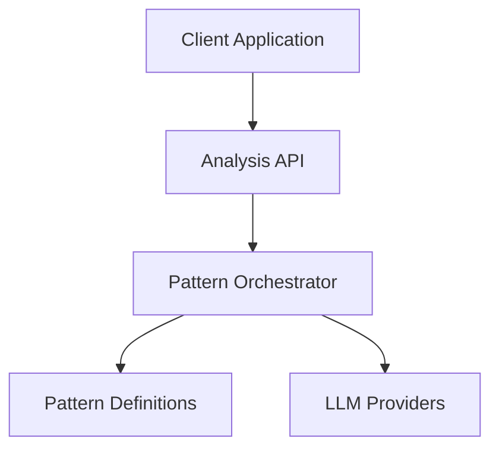
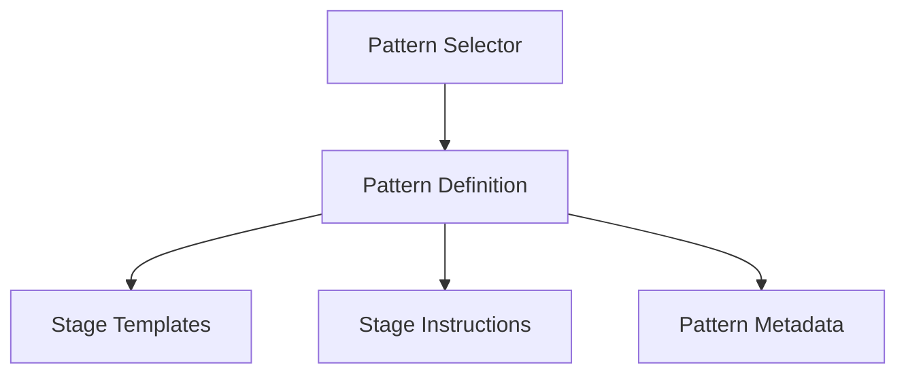

# Technical Specification: UltraAI Analysis Patterns

## Overview

This document provides the definitive technical reference for UltraAI analysis patterns (also called "feathers"). It establishes the source of truth for pattern definitions, implementation guidelines, and integration details.

## Architecture

### System Context



### Component Design



## Interfaces

### Pattern Definition Interface

```typescript
interface AnalysisPattern {
  name: string;                // Display name of the pattern
  description: string;         // Brief description of the pattern
  stages: string[];            // Stages used in this pattern
  templates: {                 // Templates for each stage
    [stage: string]: string;   // Template strings by stage name
  };
  instructions: {              // Instructions for each stage
    [stage: string]: string[]; // Array of instructions by stage name
  };
}
```

### Pattern Orchestrator Interface

```typescript
interface PatternOrchestrator {
  getPattern(patternKey: string): AnalysisPattern;
  getStagePrompt(pattern: AnalysisPattern, stage: string, context: object): string;
  getAvailablePatterns(): Array<{key: string, name: string, description: string}>;
}
```

### External Dependencies

| Dependency | Purpose | Interface |
|------------|---------|-----------|
| LLM Providers | Generate responses for each stage | Provider-specific API clients |
| Analysis API | Expose patterns to clients | RESTful API endpoints |

## Data Models

### Core Pattern Registry

```typescript
const PATTERNS: Record<string, AnalysisPattern> = {
  "gut": gutCheckAnalysis,
  "confidence": confidenceAnalysis,
  "critique": critiqueAnalysis,
  "fact_check": factCheckAnalysis,
  "perspective": perspectiveAnalysis,
  "scenario": scenarioAnalysis,
  "stakeholder": stakeholderVision,
  "systems": systemsMapper,
  "time": timeHorizon,
  "innovation": innovationBridge
};
```

### Pattern Metadata

```typescript
const PATTERN_METADATA: Record<string, {name: string, description: string}> = {
  "gut": {
    name: "Gut Check Analysis",
    description: "Relies on LLM intuition while considering other responses"
  },
  "confidence": {
    name: "Confidence Analysis",
    description: "Analyzes responses with confidence scoring and agreement tracking"
  },
  // Additional patterns...
};
```

## Available Patterns

### Gut Check Analysis

**Key**: `gut`
**Display Name**: Gut Check Analysis
**Description**: Relies on LLM intuition while considering other responses
**Best For**: Quick decisions, time-sensitive analysis, identifying consensus

**Stages**:

- initial: Direct response to the prompt
- meta: Analysis of initial intuitions
- hyper: Strengthening positions while addressing valid points
- ultra: Synthesis of compelling insights

### Confidence Analysis

**Key**: `confidence`
**Display Name**: Confidence Analysis
**Description**: Analyzes responses with confidence scoring and agreement tracking
**Best For**: Identifying reliable answers, deciding between competing solutions

**Stages**:

- initial: Direct response to the prompt
- meta: Identifying agreements, disagreements, and unique perspectives
- hyper: Highlighting consensus and evaluating argument strength
- ultra: Synthesis based on agreement patterns with confidence scoring

### Critique Analysis

**Key**: `critique`
**Display Name**: Critique Analysis
**Description**: Implements a structured critique and revision process
**Best For**: Identifying flaws, stress-testing solutions, avoiding blind spots

**Stages**:

- initial: Direct response to the prompt
- meta: Identifying strengths/weaknesses and suggesting improvements
- hyper: Addressing valid critiques while preserving core insights
- ultra: Incorporating the best elements while addressing key critiques

### Fact Check Analysis

**Key**: `fact_check`
**Display Name**: Fact Check Analysis
**Description**: Implements a rigorous fact-checking process
**Best For**: Research, historical analysis, scientific evaluation, policy analysis

**Stages**:

- initial: Direct response to the prompt
- meta: Verifying claims and checking for inconsistencies
- hyper: Addressing discrepancies and strengthening factual foundations
- ultra: Producing a factually accurate synthesis with proper citations

### Perspective Analysis

**Key**: `perspective`
**Display Name**: Perspective Analysis
**Description**: Focuses on different analytical perspectives and integration
**Best For**: Complex problems with multiple dimensions

**Stages**:

- initial: Direct response to the prompt
- meta: Analyzing from different perspectives
- hyper: Integrating viewpoints and highlighting perspective-specific insights
- ultra: Creating a balanced synthesis that integrates multiple perspectives

### Scenario Analysis

**Key**: `scenario`
**Display Name**: Scenario Analysis
**Description**: Analyzes responses through different scenarios and conditions
**Best For**: Planning, risk assessment, strategic foresight, decision-making under uncertainty

**Stages**:

- initial: Direct response to the prompt
- meta: Analyzing best case, worst case, and most likely scenarios
- hyper: Evaluating scenario robustness and dependencies
- ultra: Integrating scenario insights into robust recommendations

### Stakeholder Vision

**Key**: `stakeholder`
**Display Name**: Stakeholder Vision
**Description**: Analyzes from multiple stakeholder perspectives
**Best For**: Policy development, product design, negotiation strategy, conflict resolution

**Stages**:

- initial: Identifying stakeholders and their goals, constraints, risks
- meta: Comparing stakeholder analyses and mapping relationships
- hyper: Identifying alignments, conflicts, and coalition opportunities
- ultra: Creating a comprehensive stakeholder map with multi-win strategies

### Systems Mapper

**Key**: `systems`
**Display Name**: Systems Mapper
**Description**: Maps complex system dynamics with feedback loops
**Best For**: Complex problems, policy design, organizational change, environmental challenges

**Stages**:

- initial: Mapping system components, feedback loops, and leverage points
- meta: Integrating system maps and analyzing feedback dynamics
- hyper: Creating causal loop diagrams and modeling intervention scenarios
- ultra: Presenting an integrated system model with high-leverage intervention points

### Time Horizon

**Key**: `time`
**Display Name**: Time Horizon
**Description**: Analyzes across multiple time frames
**Best For**: Strategic planning, investment decisions, policy development, sustainability analysis

**Stages**:

- initial: Analyzing immediate, transitional, and horizon impacts
- meta: Comparing temporal analyses and identifying tradeoffs
- hyper: Creating coherent timelines and temporal decision frameworks
- ultra: Presenting a time-coherent roadmap with adaptive strategy

### Innovation Bridge

**Key**: `innovation`
**Display Name**: Innovation Bridge
**Description**: Uses cross-domain analogies to discover non-obvious patterns
**Best For**: Creative problem-solving, innovation, breaking through mental blocks

**Stages**:

- initial: Identifying analogies from different domains
- meta: Analyzing recurring patterns and unique cross-domain insights
- hyper: Developing composite analogies and extracting transcendent principles
- ultra: Translating analogical insights into practical applications

## Implementation Guidelines

### Source of Truth

The single source of truth for all pattern definitions is:

```
src/patterns/ultra_analysis_patterns.py
```

This file contains the complete implementation of all analysis patterns, including their name, description, stage definitions, template prompts, and instruction sets.

### Naming Convention

To maintain consistency across the codebase:

1. **Backend Internal Key**: Use lowercase, snake_case keys (e.g., `confidence`, `fact_check`)
2. **API/Frontend Display Name**: Use proper title case (e.g., "Confidence Analysis", "Fact Check Analysis")
3. **User-Facing Documentation**: Use title case with full descriptive names

### Adding a New Pattern

1. Add the pattern definition to `src/patterns/ultra_analysis_patterns.py`
2. Update the `get_pattern_mapping()` function to include your new pattern
3. Add the pattern to `PATTERN_METADATA` with a description
4. Update the mapping in `backend/routes/analyze_routes.py` for the API

### Modifying an Existing Pattern

1. Update only the definition in `src/patterns/ultra_analysis_patterns.py`
2. Run tests to ensure the changes work as expected
3. Update this documentation to reflect any changes in behavior

### Deprecating a Pattern

1. Mark the pattern as deprecated in documentation
2. Keep the pattern implementation but add a deprecation notice
3. Update frontend to indicate pattern is deprecated

## Error Handling

### Error States

| Error Condition | Response | Recovery |
|-----------------|----------|----------|
| Invalid pattern key | Error with available patterns | Use a valid pattern key |
| Missing stage template | Use fallback template | Create the missing template |
| Invalid stage sequence | Use default stage sequence | Correct the stage sequence |

## Testing Strategy

### Unit Testing

- Test that each pattern has required components
- Validate template and instruction formatting
- Test pattern orchestration logic

### Integration Testing

- Test pattern integration with LLM providers
- Verify correct stage sequencing
- Test multi-model orchestration

## Related Implementation Files

1. **Pattern Definitions**: `src/patterns/ultra_analysis_patterns.py`
2. **Pattern Orchestration**: `src/patterns/ultra_pattern_orchestrator.py`
3. **API Integration**: `backend/routes/analyze_routes.py`

## References

- [Intelligence Multiplication Concepts](../logic/INTELLIGENCE_MULTIPLICATION.md) - User-facing conceptual documentation
- [Analysis API Documentation](../api/ANALYSIS_API.md) - API interface documentation
- [Analysis Workflow](../workflow/ANALYSIS_WORKFLOW.md) - Multi-stage process workflow

## Changelog

| Date | Version | Changes | Author |
|------|---------|---------|--------|
| YYYY-MM-DD | 1.0 | Initial comprehensive pattern reference | UltraAI Team |
