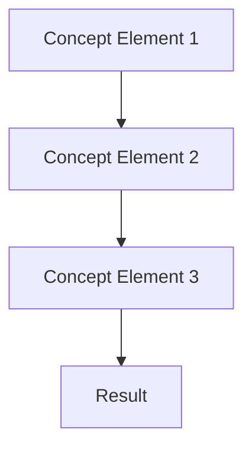

# [Concept Name]

## Overview

[1-2 paragraphs explaining the concept and its importance to the UltraAI Framework]

## Key Principles

- [Principle 1]: [Brief explanation]
- [Principle 2]: [Brief explanation]
- [Principle 3]: [Brief explanation]

## Detailed Explanation

### [Aspect 1]

[Detailed explanation of the first important aspect of this concept]

### [Aspect 2]

[Detailed explanation of the second important aspect of this concept]

### [Aspect 3]

[Detailed explanation of the third important aspect of this concept]

## Practical Applications

[Explain how this concept is applied in practice within the UltraAI Framework]

### Example Scenarios

1. **[Scenario 1]**: [Brief explanation of how the concept applies]
2. **[Scenario 2]**: [Brief explanation of how the concept applies]
3. **[Scenario 3]**: [Brief explanation of how the concept applies]

## Diagrams and Visualizations

[Include or describe any diagrams that help explain the concept]

## Relationship to Other Concepts

- **[Related Concept 1]**: [Brief explanation of relationship]
- **[Related Concept 2]**: [Brief explanation of relationship]
- **[Related Concept 3]**: [Brief explanation of relationship]

## Further Reading

- [Link to related documentation]
- [Link to external resources]
- [Link to academic papers, if applicable]

## Changelog

| Date | Version | Changes | Author |
|------|---------|---------|--------|
| YYYY-MM-DD | 1.0 | Initial documentation | [Author Name] |
