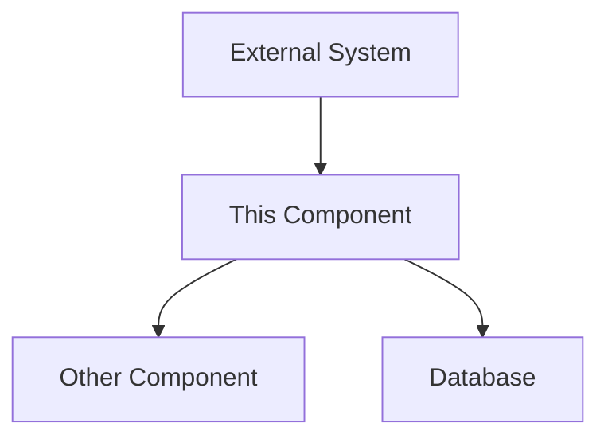
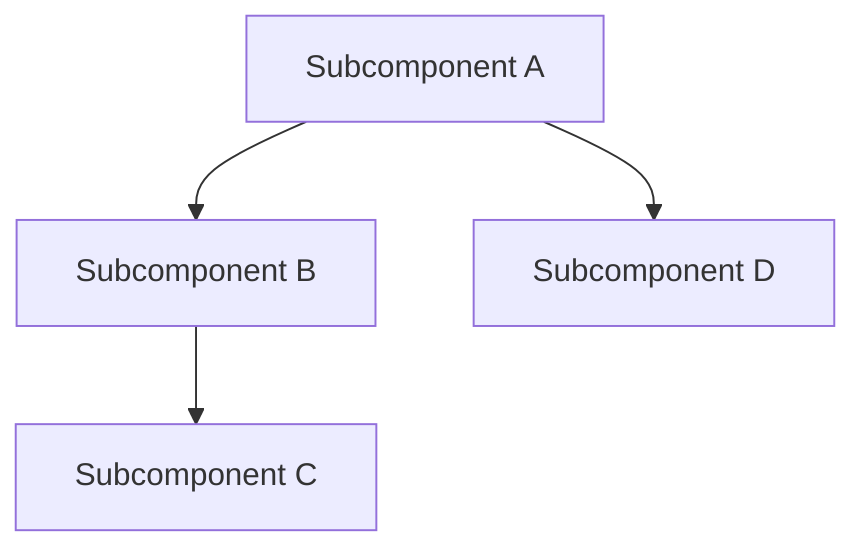
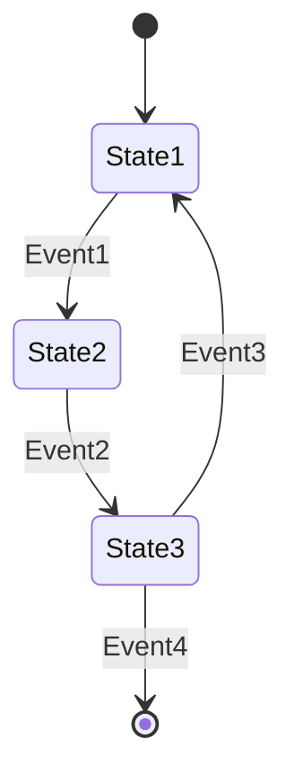

# Technical Specification: [Feature/Component Name]

## Overview

[Brief technical description of the feature/component and its purpose]

## Architecture

### System Context

[Describe where this component fits in the overall system architecture]



### Component Design

[Detailed description of the component's internal design]



## Interfaces

### Public API

[Document the public interfaces this component exposes]

```typescript
interface ComponentAPI {
  methodA(param1: Type1, param2: Type2): ReturnType;
  methodB(param1: Type1): Promise<ReturnType>;
  // Additional methods...
}
```

### External Dependencies

[Document the external systems or services this component interacts with]

| Dependency | Purpose | Interface |
|------------|---------|-----------|
| [Dependency 1] | [Purpose] | [Interface details] |
| [Dependency 2] | [Purpose] | [Interface details] |

## Data Models

### Core Data Structures

[Detail the core data structures used in this component]

```typescript
interface ModelA {
  fieldA: string;
  fieldB: number;
  fieldC: boolean;
}

interface ModelB {
  fieldA: string;
  fieldB: ModelA[];
  fieldC: Map<string, any>;
}
```

### Database Schema

[If applicable, document the database schema used]

```sql
CREATE TABLE table_name (
  column1 datatype constraints,
  column2 datatype constraints,
  column3 datatype constraints
);
```

## Algorithms and Logic

### Key Algorithms

[Document important algorithms or business logic]

```
ALGORITHM Name
INPUT: ...
OUTPUT: ...
1. Step 1
2. Step 2
3. Step 3
```

### State Machine

[If applicable, document state transitions]



## Security Considerations

### Authentication & Authorization

[Document authentication and authorization requirements]

### Data Protection

[Document data protection measures]

### Audit & Logging

[Document audit and logging requirements]

## Performance Considerations

### Scalability

[Document how the component scales]

### Efficiency

[Document performance characteristics and optimizations]

## Error Handling

### Error States

[Document possible error states and their handling]

| Error Condition | Response | Recovery |
|-----------------|----------|----------|
| [Error 1] | [Response] | [Recovery action] |
| [Error 2] | [Response] | [Recovery action] |

### Logging Strategy

[Document logging approach for troubleshooting]

## Testing Strategy

### Unit Testing

[Document approach to unit testing]

### Integration Testing

[Document approach to integration testing]

### Performance Testing

[Document approach to performance testing]

## Deployment Considerations

### Requirements

[Document deployment requirements]

### Configuration

[Document configuration parameters]

| Parameter | Purpose | Default | Valid Values |
|-----------|---------|---------|-------------|
| [Param 1] | [Purpose] | [Default] | [Valid values] |
| [Param 2] | [Purpose] | [Default] | [Valid values] |

## Maintenance

### Monitoring

[Document monitoring approach]

### Troubleshooting

[Document common troubleshooting approaches]

## Open Issues

- [Issue 1]
- [Issue 2]
- [Issue 3]

## Glossary

| Term | Definition |
|------|------------|
| [Term 1] | [Definition] |
| [Term 2] | [Definition] |

## References

- [Reference 1]
- [Reference 2]

## Changelog

| Date | Version | Changes | Author |
|------|---------|---------|--------|
| YYYY-MM-DD | 1.0 | Initial technical specification | [Author Name] |
