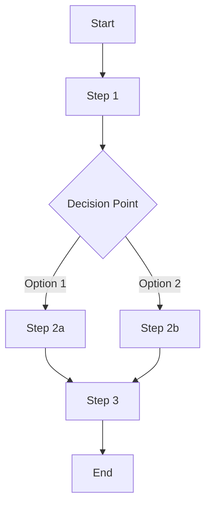

# Workflow: [Workflow Name]

## Overview

[Brief description of the workflow and its purpose in the system]

## Workflow Diagram

## Participants and Roles

| Role | Responsibilities | Required Skills |
|------|------------------|-----------------|
| [Role 1] | [Responsibilities] | [Skills] |
| [Role 2] | [Responsibilities] | [Skills] |
| [Role 3] | [Responsibilities] | [Skills] |

## Steps

### 1. [Step 1 Name]

**Description**: [Detailed description of the step]

**Inputs**:

- [Input 1]
- [Input 2]

**Actions**:

1. [Action 1]
2. [Action 2]
3. [Action 3]

**Outputs**:

- [Output 1]
- [Output 2]

**Tools/Resources**:

- [Tool/Resource 1]
- [Tool/Resource 2]

### 2. [Step 2 Name]

**Description**: [Detailed description of the step]

**Inputs**:

- [Input 1]
- [Input 2]

**Actions**:

1. [Action 1]
2. [Action 2]
3. [Action 3]

**Outputs**:

- [Output 1]
- [Output 2]

**Tools/Resources**:

- [Tool/Resource 1]
- [Tool/Resource 2]

[Continue for all steps in the workflow]

## Decision Points

### [Decision Point 1]

**Context**: [When this decision occurs]

**Options**:

1. **[Option 1]**:
   - **Criteria**: [When to choose this option]
   - **Outcome**: [What happens if this option is chosen]

2. **[Option 2]**:
   - **Criteria**: [When to choose this option]
   - **Outcome**: [What happens if this option is chosen]

## Inputs and Outputs

### Workflow Inputs

- [Input 1]: [Description]
- [Input 2]: [Description]

### Workflow Outputs

- [Output 1]: [Description]
- [Output 2]: [Description]

## Timing and SLAs

| Step | Expected Duration | Maximum Duration | SLA |
|------|-------------------|------------------|-----|
| [Step 1] | [Time] | [Time] | [SLA details] |
| [Step 2] | [Time] | [Time] | [SLA details] |
| [Step 3] | [Time] | [Time] | [SLA details] |
| **Total** | [Time] | [Time] | [Overall SLA] |

## Exception Handling

### [Exception 1]

- **Trigger**: [What causes this exception]
- **Response**: [How to respond]
- **Recovery Path**: [How to recover and continue the workflow]
- **Escalation**: [When and how to escalate]

### [Exception 2]

- **Trigger**: [What causes this exception]
- **Response**: [How to respond]
- **Recovery Path**: [How to recover and continue the workflow]
- **Escalation**: [When and how to escalate]

## Key Performance Indicators

- **[KPI 1]**: [Description and target]
- **[KPI 2]**: [Description and target]
- **[KPI 3]**: [Description and target]

## Related Workflows

- [Related Workflow 1]: [Brief description of relationship]
- [Related Workflow 2]: [Brief description of relationship]

## Tools and Systems

| Tool/System | Purpose | Access Requirements |
|-------------|---------|---------------------|
| [Tool 1] | [Purpose] | [Access details] |
| [Tool 2] | [Purpose] | [Access details] |
| [Tool 3] | [Purpose] | [Access details] |

## Training Requirements

- [Training requirement 1]
- [Training requirement 2]
- [Training requirement 3]

## References

- [Reference 1]
- [Reference 2]
- [Reference 3]

## Changelog

| Date | Version | Changes | Author |
|------|---------|---------|--------|
| YYYY-MM-DD | 1.0 | Initial workflow documentation | [Author Name] |
