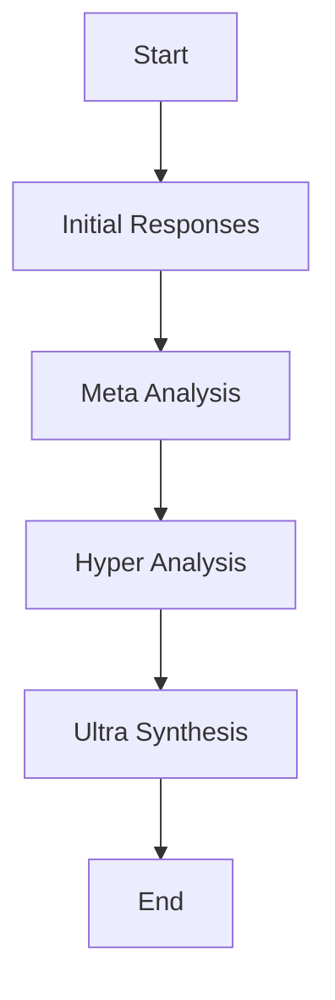

# Workflow: Multi-Stage Analysis Process

## Overview

This workflow describes the orchestrated multi-stage analysis process used in the UltraAI Framework to combine responses from multiple Large Language Models (LLMs) into a comprehensive analysis.

## Workflow Diagram

## Participants and Roles

| Role | Responsibilities | Required Skills |
|------|------------------|-----------------|
| User | Provides the initial prompt and selects analysis pattern | Understanding of analysis needs |
| System Orchestrator | Manages the multi-stage process and coordinates model interactions | Automated component of UltraAI |
| LLM Models | Generate responses at each stage of analysis | Varies by model capability |

## Steps

### 1. Initial Responses

**Description**: In this first stage, the system gathers independent responses from all available models based on the user's initial prompt.

**Inputs**:

- User prompt
- Selected analysis pattern
- Available LLM models

**Actions**:

1. Send the user prompt to each available model
2. Collect all independent responses
3. Store responses for the next stage

**Outputs**:

- Collection of independent model responses

**Tools/Resources**:

- API connections to LLM providers
- Response storage system

### 2. Meta Analysis

**Description**: Each model analyzes and reviews the collective responses from the initial stage, providing higher-level insights.

**Inputs**:

- All initial responses from Stage 1
- Analysis pattern parameters

**Actions**:

1. Send all initial responses to each model
2. Ask each model to analyze the collective responses according to the selected pattern
3. Collect meta-level reviews

**Outputs**:

- Collection of meta-level reviews

**Tools/Resources**:

- Pattern-specific prompts
- Cross-model analysis tools

### 3. Hyper Analysis

**Description**: Models analyze the meta-level reviews, looking for patterns, agreements, disagreements, and insights across the reviews.

**Inputs**:

- Meta-level reviews from Stage 2

**Actions**:

1. Send all meta-level reviews to each model
2. Ask each model to analyze the meta-reviews
3. Collect hyper-level insights

**Outputs**:

- Collection of hyper-level insights

**Tools/Resources**:

- Advanced pattern evaluation tools
- Agreement/disagreement detection algorithms

### 4. Ultra Synthesis

**Description**: A final comprehensive synthesis is produced, bringing together all levels of analysis into a coherent, integrated response.

**Inputs**:

- Initial responses
- Meta-level reviews
- Hyper-level insights

**Actions**:

1. Combine all levels of analysis
2. Generate a synthesized response that integrates insights from all stages
3. Format the final output according to user preferences

**Outputs**:

- Comprehensive synthesized analysis
- Supporting materials (if applicable)

**Tools/Resources**:

- Synthesis algorithms
- Output formatting tools

## Decision Points

### Analysis Pattern Selection

**Context**: When the user initiates an analysis

**Options**:

1. **Standard Analysis Pattern**:
   - **Criteria**: When a basic analysis of a topic is needed
   - **Outcome**: A straightforward multi-model analysis

2. **Specialized Analysis Pattern**:
   - **Criteria**: When a specific analytical approach is needed (e.g., Gut Check, Critique, Perspective)
   - **Outcome**: Analysis follows the specialized pattern methodology

## Inputs and Outputs

### Workflow Inputs

- User prompt: The question or topic to be analyzed
- Selected analysis pattern: The specific analysis methodology to apply
- Available models: The set of LLM models available for the analysis

### Workflow Outputs

- Ultra Synthesis: The final comprehensive analysis
- Supporting data: Insights from various stages (if requested)

## Timing and SLAs

| Step | Expected Duration | Maximum Duration | SLA |
|------|-------------------|------------------|-----|
| Initial Responses | 5-10 seconds | 30 seconds | 95% completion in <15 seconds |
| Meta Analysis | 10-20 seconds | 60 seconds | 95% completion in <30 seconds |
| Hyper Analysis | 10-20 seconds | 60 seconds | 95% completion in <30 seconds |
| Ultra Synthesis | 15-30 seconds | 90 seconds | 95% completion in <45 seconds |
| **Total** | 40-80 seconds | 240 seconds | 95% completion in <120 seconds |

## Exception Handling

### Model Failure

- **Trigger**: One or more models fail to respond
- **Response**: System proceeds with available model responses
- **Recovery Path**: Analysis continues with reduced model diversity, flagged in output
- **Escalation**: If fewer than 2 models are available, alert user and offer alternatives

### Timeout

- **Trigger**: A stage exceeds maximum duration
- **Response**: Move to next stage with partial results
- **Recovery Path**: Continue analysis with available data
- **Escalation**: Report timeout in final output with appropriate disclaimer

## Key Performance Indicators

- **Response Diversity**: Measure of diversity in model responses
- **Analysis Coherence**: Rating of how well the final synthesis integrates perspectives
- **Response Time**: Total time from prompt submission to final output
- **User Satisfaction**: User ratings of analysis quality

## Related Workflows

- Analysis Pattern Selection: Workflow for selecting and configuring patterns
- Document-Augmented Analysis: Workflow when including document context

## Tools and Systems

| Tool/System | Purpose | Access Requirements |
|-------------|---------|---------------------|
| LLM API Clients | Connect to model providers | API keys and permissions |
| Analysis Orchestrator | Manage the multi-stage process | System component |
| Response Storage | Maintain state between stages | Internal system access |

## Training Requirements

- Understanding of available analysis patterns
- Knowledge of model capabilities and limitations
- Familiarity with prompt engineering for effective analysis

## References

- [Analysis Patterns Documentation](../instructions/PATTERNS.md)
- [Intelligence Multiplication Concepts](../logic/INTELLIGENCE_MULTIPLICATION.md)
- [Analysis Troubleshooting Guide](../instructions/ANALYSIS_TROUBLESHOOTING.md)

## Changelog

| Date | Version | Changes | Author |
|------|---------|---------|--------|
| YYYY-MM-DD | 1.0 | Initial workflow documentation | UltraAI Team |
