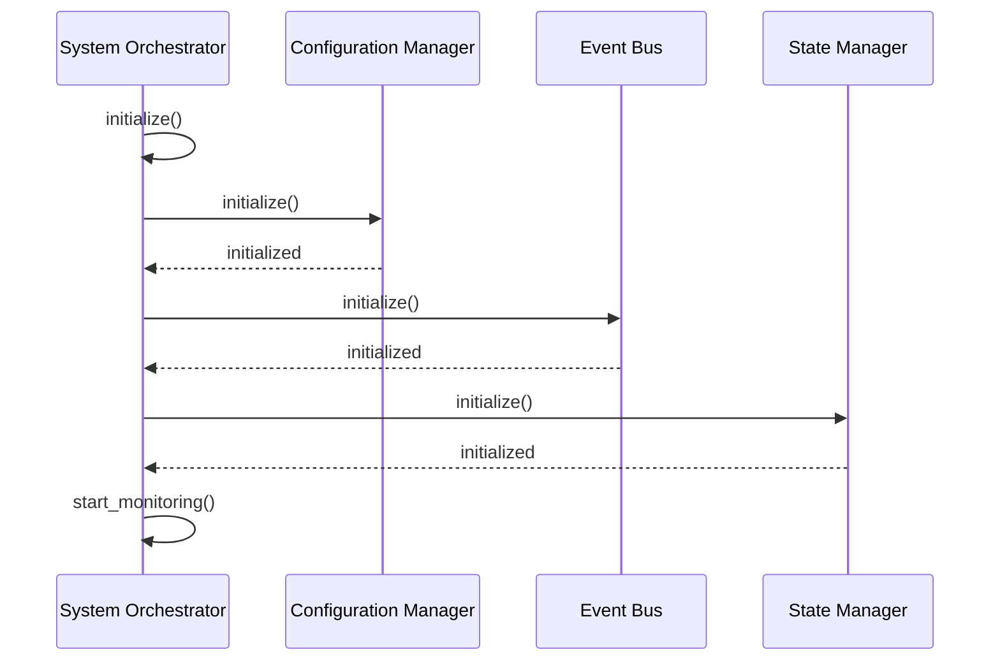
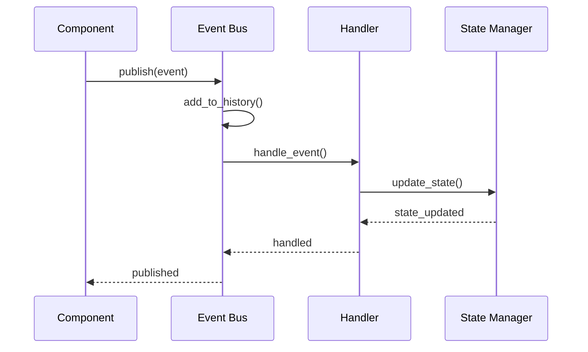
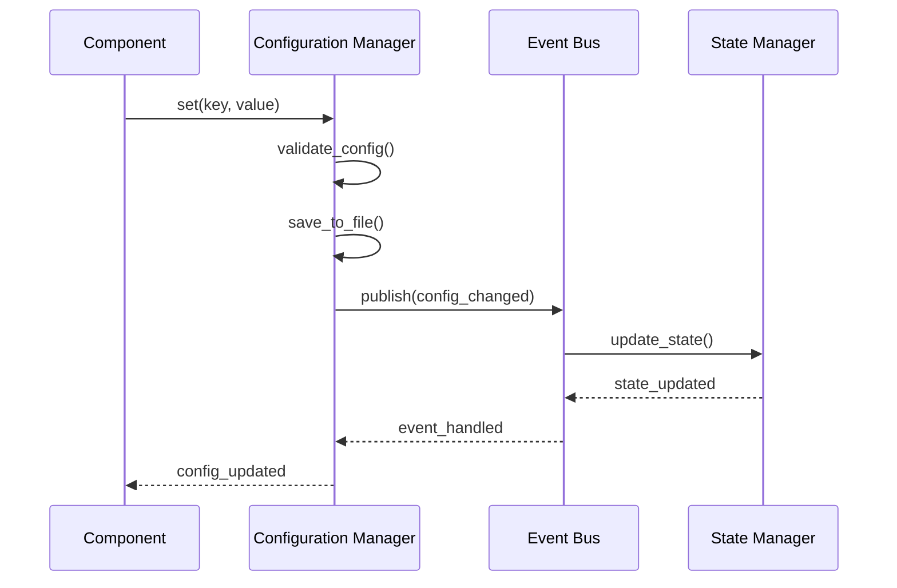
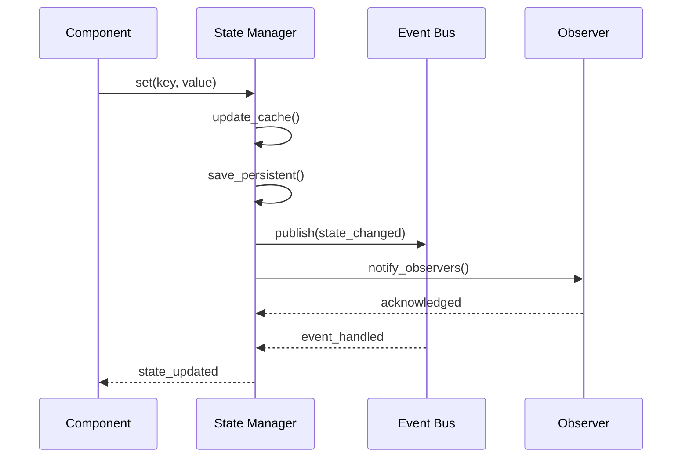
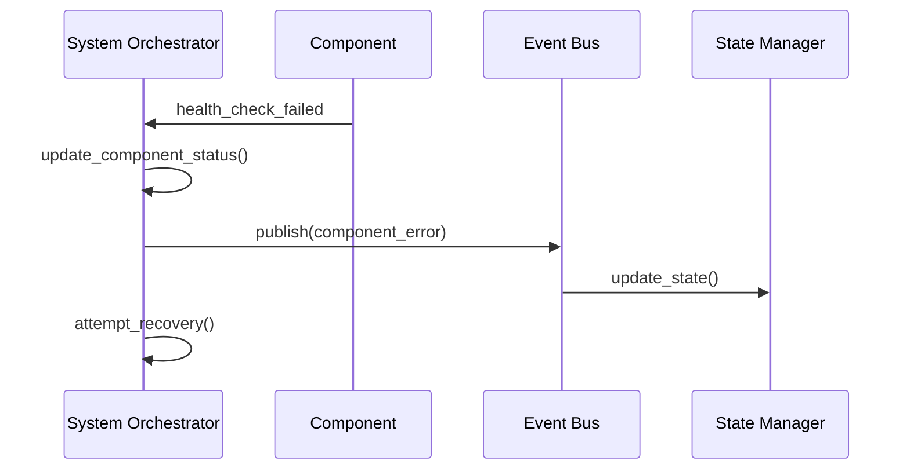
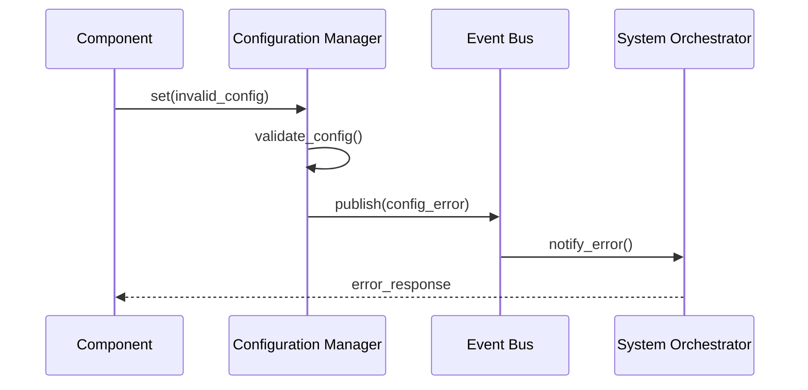
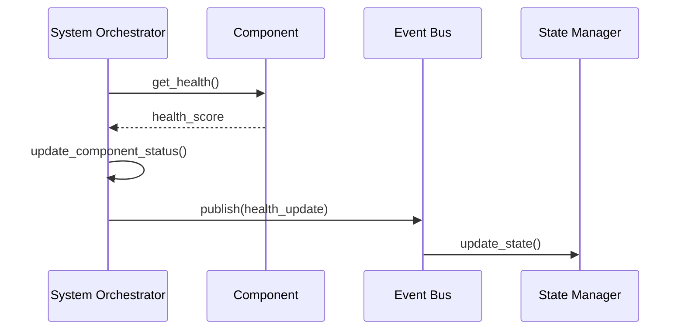

# UltraAI Core Component Interactions

## Overview

This document describes the interactions between UltraAI's core components:

1. System Orchestrator
2. Configuration Manager
3. Event Bus
4. State Manager

## Component Interaction Diagrams

### System Initialization Flow

### Event Flow

### Configuration Update Flow

### State Management Flow

## Component Responsibilities

### System Orchestrator

- Initializes and manages core components
- Monitors component health
- Coordinates system startup and shutdown
- Handles component registration

### Configuration Manager

- Manages system configuration
- Handles configuration validation
- Supports multiple configuration sources
- Persists configuration changes

### Event Bus

- Facilitates inter-component communication
- Manages event subscriptions
- Maintains event history
- Handles event prioritization

### State Manager

- Manages system state
- Handles state persistence
- Provides caching mechanism
- Notifies state observers

## Interaction Patterns

### 1. Component Registration

1. Component calls `register_component()` on System Orchestrator
2. System Orchestrator adds component to registry
3. Component status monitoring begins
4. Health checks are scheduled

### 2. Event Publishing

1. Component creates an Event object
2. Event is published to Event Bus
3. Event Bus processes event based on priority
4. Registered handlers receive and process event
5. Event is added to history

### 3. Configuration Changes

1. Component requests configuration change
2. Configuration Manager validates change
3. Change is persisted if valid
4. Configuration change event is published
5. Observers are notified

### 4. State Updates

1. Component requests state update
2. State Manager validates update
3. State is updated in memory/cache
4. Persistent state is saved if needed
5. State change event is published
6. Observers are notified

## Error Handling

### Component Failure

### Configuration Error

## Health Monitoring

### Component Health Check

## Success Criteria

The component interaction architecture is successful when:

1. All components can communicate effectively
2. Events are properly propagated
3. State is consistently managed
4. Configuration changes are properly handled
5. Error handling is robust
6. Health monitoring is effective

## Implementation Notes

1. All interactions are asynchronous
2. Components use type hints
3. Error handling is comprehensive
4. Logging is consistent
5. Health checks are regular
6. State persistence is reliable

## Next Steps

1. Implement component interaction tests
2. Add monitoring dashboards
3. Enhance error recovery
4. Optimize event processing
5. Add performance metrics
