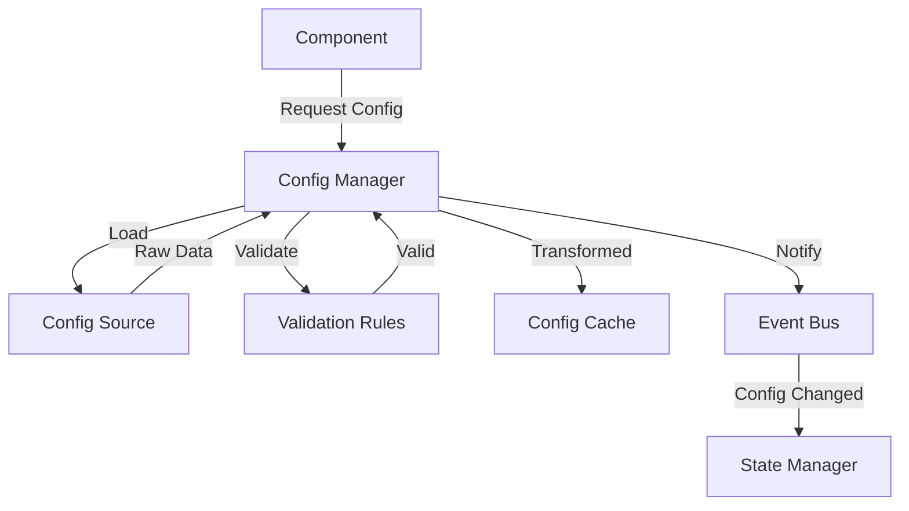
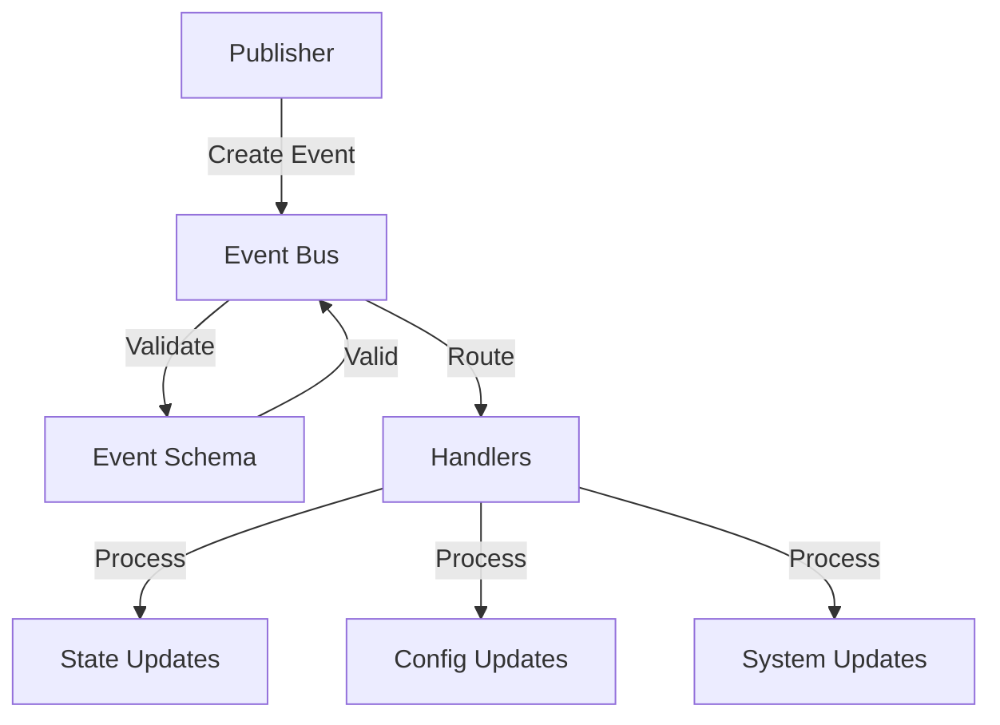
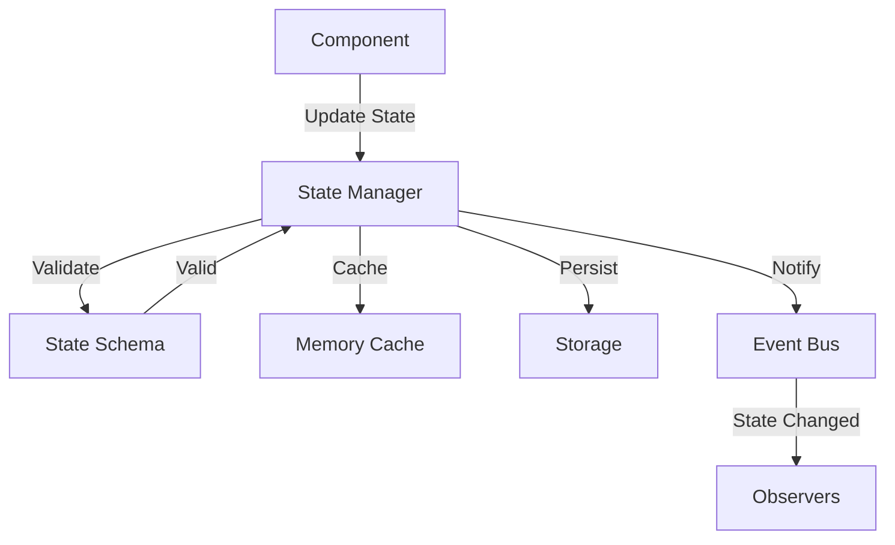
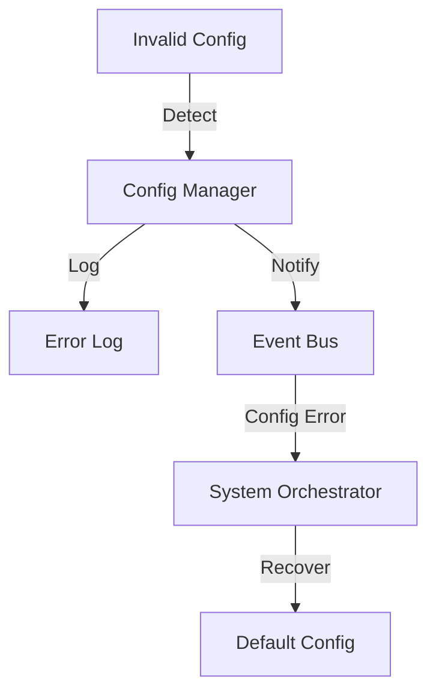
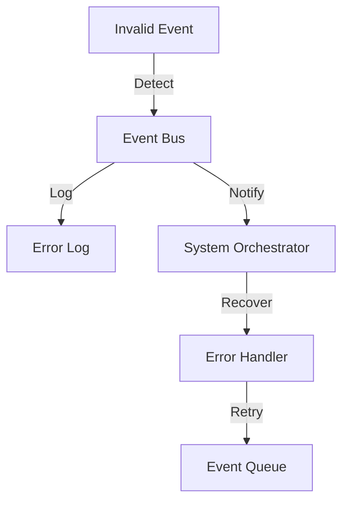
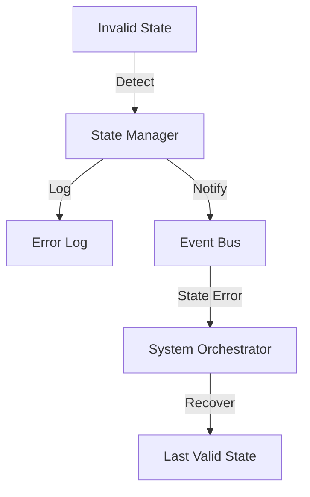

# UltraAI Data Flow Patterns

## Overview

This document defines the data flow patterns between UltraAI's core components, including:

1. Data transformation rules
2. Validation requirements
3. Flow diagrams
4. Error handling

## Data Types

### 1. Configuration Data

```python
@dataclass
class ConfigData:
    key: str
    value: Any
    source: ConfigSource
    metadata: Dict[str, Any]
    validation_rules: List[Callable]
```

### 2. Event Data

```python
@dataclass
class EventData:
    name: str
    payload: Any
    metadata: Dict[str, Any]
    timestamp: float
    correlation_id: Optional[str]
```

### 3. State Data

```python
@dataclass
class StateData:
    key: str
    value: Any
    type: StateType
    metadata: Dict[str, Any]
    version: int
```

## Data Flow Patterns

### 1. Configuration Flow



#### Transformation Rules

1. Environment variables are converted to appropriate types
2. File-based configs are parsed and validated
3. Memory configs are type-checked
4. Default values are applied when needed

#### Validation Requirements

1. Type checking
2. Value range validation
3. Required field validation
4. Dependency validation

### 2. Event Flow



#### Transformation Rules

1. Event names are normalized
2. Payloads are validated against schemas
3. Timestamps are standardized
4. Correlation IDs are generated

#### Validation Requirements

1. Event name format
2. Payload schema
3. Required metadata
4. Priority validation

### 3. State Flow



#### Transformation Rules

1. State values are type-checked
2. Versions are incremented
3. Timestamps are updated
4. Metadata is enriched

#### Validation Requirements

1. State key format
2. Value type checking
3. Version consistency
4. Access control

## Error Handling

### 1. Configuration Errors



### 2. Event Errors



### 3. State Errors



## Data Validation Rules

### 1. Configuration Validation

```python
def validate_config(config: Dict[str, Any]) -> bool:
    """Validate configuration data."""
    try:
        # Check required fields
        required_fields = ["key", "value", "source"]
        for field in required_fields:
            if field not in config:
                raise ValueError(f"Missing required field: {field}")

        # Validate source
        if not isinstance(config["source"], ConfigSource):
            raise ValueError("Invalid config source")

        # Validate value type
        if not validate_value_type(config["value"]):
            raise ValueError("Invalid value type")

        return True
    except Exception as e:
        logger.error(f"Config validation failed: {str(e)}")
        return False
```

### 2. Event Validation

```python
def validate_event(event: Event) -> bool:
    """Validate event data."""
    try:
        # Check required fields
        required_fields = ["name", "data", "timestamp"]
        for field in required_fields:
            if field not in event.__dict__:
                raise ValueError(f"Missing required field: {field}")

        # Validate event name
        if not validate_event_name(event.name):
            raise ValueError("Invalid event name")

        # Validate timestamp
        if not validate_timestamp(event.timestamp):
            raise ValueError("Invalid timestamp")

        return True
    except Exception as e:
        logger.error(f"Event validation failed: {str(e)}")
        return False
```

### 3. State Validation

```python
def validate_state(state: StateData) -> bool:
    """Validate state data."""
    try:
        # Check required fields
        required_fields = ["key", "value", "type"]
        for field in required_fields:
            if field not in state.__dict__:
                raise ValueError(f"Missing required field: {field}")

        # Validate state type
        if not isinstance(state.type, StateType):
            raise ValueError("Invalid state type")

        # Validate version
        if not validate_version(state.version):
            raise ValueError("Invalid version")

        return True
    except Exception as e:
        logger.error(f"State validation failed: {str(e)}")
        return False
```

## Data Flow Success Criteria

The data flow patterns are successful when:

1. All data transformations are consistent
2. Validation rules are comprehensive
3. Error handling is robust
4. Data flow is efficient
5. State is maintained correctly
6. Events are properly propagated

## Implementation Notes

1. Use type hints consistently
2. Implement comprehensive validation
3. Handle errors gracefully
4. Log all transformations
5. Monitor data flow
6. Optimize performance

## Next Steps

1. Implement data validation
2. Add monitoring
3. Create tests
4. Optimize flows
5. Document APIs
