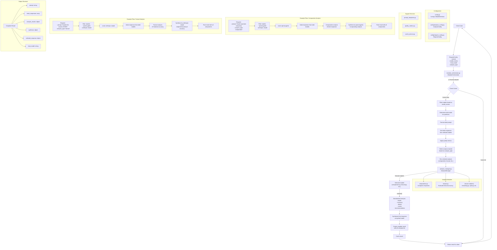

# Modular Orchestrator Data Flow - Iteration 3



## Key Process Steps

1. **Request Configuration**

   - User creates a `RequestConfig` with prompt, model selection, and analysis type
   - Alternatively, user can provide a dictionary with the same information

2. **Model Selection**

   - Orchestrator filters available models based on user selection
   - If no models specified, all available models are used
   - Determines lead model for synthesis (user-specified or highest priority)

3. **Initial Response Generation**

   - Format prompt using templates
   - Send to all selected models in parallel
   - Collect and evaluate responses with quality metrics

4. **Analysis Module Selection**

   - Select appropriate analysis module based on analysis_type
   - Module is loaded and configured by the AnalysisManager

5. **Analysis Execution**

   - The selected analysis module processes the initial responses
   - Analysis is performed by the lead model if an LLM is needed
   - Standardized results are produced with summary, details, and scores

6. **Synthesis**

   - Lead model synthesizes the final response
   - Takes into account initial responses and analysis
   - Produces an optimized answer

7. **Result Creation**
   - Comprehensive result is created with all components
   - Includes initial responses, analysis, synthesis, and metadata
   - Cached for future use if the same request is made

## Data Structures

### Request Config

```python
{
  "prompt": "What are the key considerations for implementing AI in healthcare?",
  "model_names": ["openai-gpt4o", "anthropic-claude"],
  "lead_model": "anthropic-claude",
  "analysis_type": "comparative"
}
```

### Analysis Result

```python
{
  "module": "comparative",
  "summary": "Analysis summary text...",
  "details": {
    "response_count": 2,
    "prompt": "Analysis prompt text..."
  },
  "scores": {
    "openai-gpt4o": 0.85,
    "anthropic-claude": 0.92
  },
  "recommendations": [
    "Combine elements from both responses for optimal answer."
  ]
}
```

### Complete Result

```python
{
  "prompt": "Original prompt text...",
  "initial_responses": [
    {
      "model": "openai-gpt4o",
      "provider": "openai",
      "response": "Response text...",
      "response_time": 2.5,
      "quality_score": 0.85
    },
    {
      "model": "anthropic-claude",
      "provider": "anthropic",
      "response": "Response text...",
      "response_time": 3.2,
      "quality_score": 0.92
    }
  ],
  "analysis_results": {
    "modules": ["comparative"],
    "weights": {"comparative": 1.0},
    "individual_results": {
      "comparative": {
        "module": "comparative",
        "summary": "Analysis summary...",
        "details": {...},
        "scores": {...},
        "recommendations": [...]
      }
    },
    "combined_summary": "Analysis from comparative (weight: 1.00):\n..."
  },
  "synthesis": {
    "response": "Synthesized response text...",
    "model": "anthropic-claude",
    "provider": "anthropic",
    "time": 2.8
  },
  "selected_response": {
    "response": "Best individual response text...",
    "model": "anthropic-claude",
    "provider": "anthropic",
    "quality_score": 0.92
  },
  "lead_model": "anthropic-claude"
}
```
